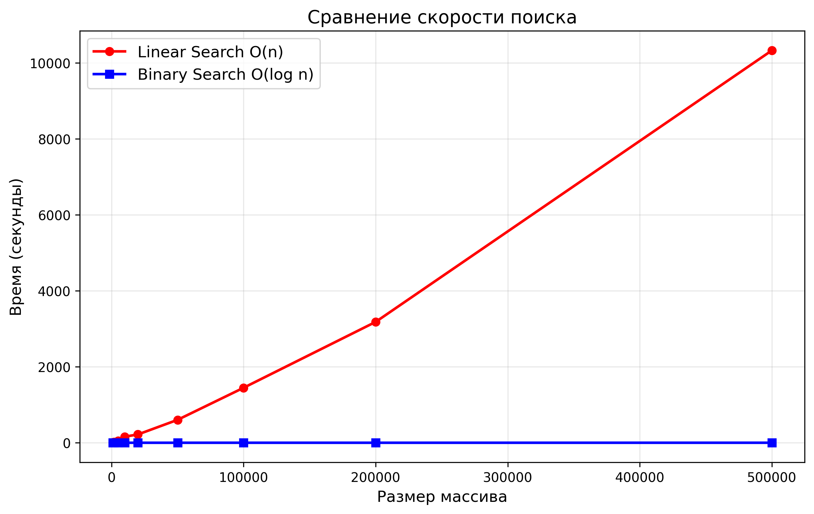
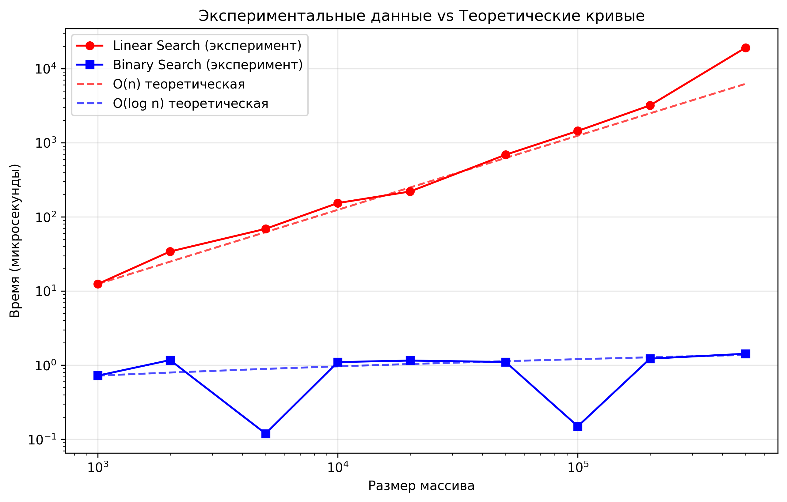
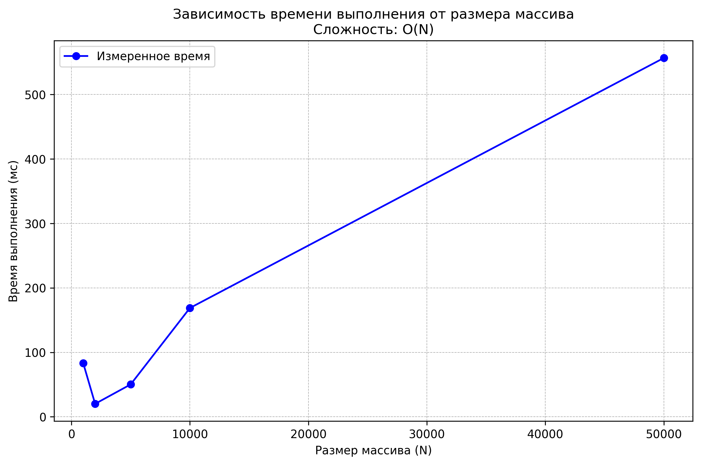

# Отчет по лабораторной работе 1
# Введение в алгоритмы. Сложность. Поиск.

**Дата:** 2025-11-01  
**Семестр:** 3 курс 1 полугодие - 5 семестр  
**Группа:** ПИЖ-б-о-23-2(1)  
**Дисциплина:** Анализ сложности алгоритмов  
**Студент:** Хатуаева Дайана Тныбековна

## Цель работы
Освоить понятие вычислительной сложности алгоритма. Получить практические навыки реализации и анализа линейного и бинарного поиска. Научиться экспериментально подтверждать теоретические оценки сложности O(n) и O(log n).

## Теоретическая часть
 - Сложность алгоритма: Характеризует количество ресурсов (времени и памяти), необходимых алгоритму для обработки входных данных объема n.  
- Асимптотический анализ: Анализ поведения алгоритма при стремлении n к бесконечности. Позволяет абстрагироваться от констант и аппаратных особенностей.
- O-нотация («О-большое»): Верхняя асимптотическая оценка роста функции. Определяет наихудший сценарий работы алгоритма.  
- Линейный поиск (Linear Search): Последовательный перебор всех элементов массива. Сложность: O(n).
- Бинарный поиск (Binary Search): Поиск в отсортированном массиве путем многократного
деления интервала поиска пополам. Сложность: O(log n). Требует предварительной сортировки (O(n log n)).

## Практическая часть

### Выполненные задачи
- [x] Задача 1: Реализовать функцию линейного поиска элемента в массиве.
- [x] Задача 2: Реализовать функцию бинарного поиска элемента в отсортированном массиве.
- [x] Задача 3: Провести теоретический анализ сложности обоих алгоритмов.
- [x] Задача 4: Экспериментально сравнить время выполнения алгоритмов на массивах разного размера.
- [x] Задача 5: Визуализировать результаты, подтвердив асимптотику O(n) и O(log n).

### Ключевые фрагменты кода

#### Характеристика ПК, на котором проводятся все замеры:
```python
pc_info = """
    Характеристики ПК для тестирования:
    - Процессор: 12th Gen Intel(R) Core(TM) i5-12450H
    - Оперативная память: 16 GB DDR4
    - ОС: Windows 10
    - Python: 3.12.10
    """
print(pc_info)
```
#### Функция линейного поиска:
```python
def linear_search(arr, target):
    # Цикл проходится по каждому элементу массива => O(n)
    for i in range(len(arr)):  # O(n)
        if arr[i] == target:  # O(1)
            return i  # O(1)
    return -1  # O(1)
# Общая сложность линейного поиска => O(n)
```

#### Функция бинарного поиска:
```python
def binary_search(arr, target):
    lower_bound = 0  # O(1)
    upper_bound = len(arr) - 1  # O(1)

    while lower_bound <= upper_bound:  # O(logn)
        center = (lower_bound + upper_bound) // 2  # O(1)
        if arr[center] == target:  # O(1)
            return center  # O(1)
        elif arr[center] < target:  # O(1)
            lower_bound = center + 1  # O(1)
        elif arr[center] > target:  # O(1)
            upper_bound = center - 1  # O(1)
    return -1  # O(1)
# Общая сложность бинарного поиска - O(logn)
```

#### Списки для хранения данных (размеры массивов, время линейного поиска и время бинарного поиска соответветственно):

```python
sizes = [1000, 2000, 5000, 10000, 20000, 50000, 100000,
         200000, 500000]  # размеры массивов
linear_times = []
binary_times = []
```

#### Заголовки для вывода результатов:
```python
print("Замеры времени выполнения")
print("Размер(N)", "      Линейный(мкс)", " Бинарный(мкс)",
      "   Линейный/Размер", " Бинарный/Размер")
print("=" * 78)
```

#### Измерение времени для линейного поиска с помощью модуля time:
```python
    start_time = time.perf_counter()
    for _ in range(10):
        linear_search(data, target)
    end_time = time.perf_counter()
    linear_time = (end_time - start_time) / 10 * 1_000_000
    linear_times.append(linear_time)
```

#### Измерение времени для бинарного поиска:
```python
    start_time = time.perf_counter()
    for _ in range(10):
        binary_search(data, target)
    end_time = time.perf_counter()
    binary_time = (end_time - start_time) / 10 * 1_000_000
    binary_times.append(binary_time)
```

#### Построение графиков для отображения результата:  
```python
plt.figure(figsize=(15, 6))

plt.subplot(1, 2, 1)
plt.plot(sizes, linear_times, 'o-', label='Линейный поиск O(n)',
         linewidth=2, markersize=6)
plt.plot(sizes, binary_times, 's-', label='Бинарный поиск O(logn)',
         linewidth=2, markersize=6)
plt.xlabel('Размер массива (N)')
plt.ylabel('Время выполнения в микросекундах')
plt.title('Сравнение времени выполнения алгоритмов поиска\n(линейный масштаб)')
plt.grid(True, alpha=0.3)
plt.legend()

plt.subplot(1, 2, 2)
plt.semilogy(sizes, linear_times, 'o-', label='Линейный поиск O(n)',
             linewidth=2, markersize=6)
plt.semilogy(sizes, binary_times, 's-', label='Бинарный поиск O(logn)',
             linewidth=2, markersize=6)
plt.xlabel('Размер массива (N)')
plt.ylabel('Время выполнения (микросекунды) - логарифмическая шкала')
plt.title('Сравнение времени выполнения алгоритмов'
          'поиска\n(логарифмический масштаб по Y)')
plt.grid(True, alpha=0.3)
plt.legend()

plt.tight_layout()

plt.show()
```

## Результаты выполнения








## Ответы на контрольные вопросы
1. Что такое асимптотическая сложность алгоритма и зачем она нужна?

Асимптотическая сложность алгоритма — это математическая характеристика, выражающая зависимость между объёмом входных данных и количеством элементарных операций, необходимых для выполнения алгоритма. Она описывает скорость роста времени работы алгоритма с увеличением размера входных данных в пределе, когда этот размер стремится к бесконечности. Она нужна для оценки эффективности алгоритмов, фокусируясь на их поведении при больших объёмах входных данных. 

2. Объясните разницу между O(1), O(n) и O(log n). Приведите примеры алгоритмов с такой сложностью.

- O(1) — постоянное время (доступ к элементу массива по индексу).

- O(n) — линейный рост (поиск максимума в неотсортированном массиве).

- O(log n) — логарифмический рост (бинарный поиск в отсортированном массиве).

3. В чем основное отличие линейного поиска от бинарного? Какие предварительные условия необходимы для выполнения бинарного поиска?

- Линейный — проверяет все элементы подряд, O(n).

- Бинарный — делит отсортированный массив пополам, O(log n).
Условия для бинарного поиска: массив должен быть отсортирован.

4. Почему на практике время выполнения алгоритма может отличаться от теоретической оценки O-большое?

Практическое время может отличаться от O-оценки потому что O-нотация описывает рост при n → ∞ и игнорирует константы и меньшие члены. Также на это влияют оптимизация процессора, кэш, язык программирования, особенности данных.

5. Как экспериментально подтвердить, что сложность алгоритма равна O(n) или O(log n)? Опишите план эксперимента.

Для этого можно замерить время выполнения алгоритма на наборах данных разного размера (n). Затем построить график, отображающий зависимость времени выполнения от размера данных. После этого проанализировать форму кривой:  
- O(n): график близок к прямой линии.
- O(log n): рост резко замедляется с увеличением n.

Для точности можно усреднить результаты по множеству запусков.

### Рекомендованная литература
1. Юрий Петров: "Программирование на Python" — онлайн-курс и учебные материалы. Ссылка для изучения: https://www.yuripetrov.ru/edu/python/index.html
2. Кормен, Т., Лейзерсон, Ч., Ривест, Р., Штайн, К. Алгоритмы: построение и анализ, 3-е издание. — М.: Вильямс, 2022. — 1328 с. (Оригинальное название: Cormen, T.H., Leiserson, C.E., Rivest, R.L., Stein, C. Introduction to Algorithms, 3rd Edition)
3. Скиена, С. Алгоритмы. Руководство по разработке, 3-е издание. — СПб.: БХВ-Петербург, 2022. — 720 с. (Оригинальное название: Skiena, Steven S. The Algorithm Design Manual 3rd ed.)