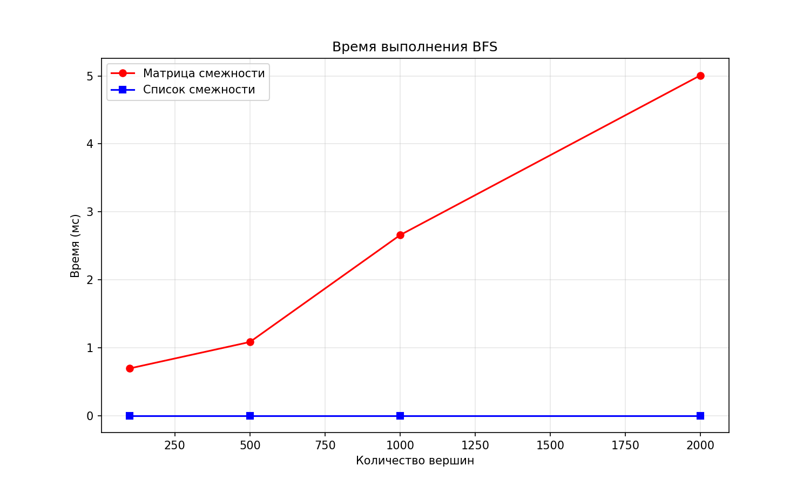

# Отчет по лабораторной работе 10
# Графы

**Дата:** 2025-12-26  
**Семестр:** 3 курс 1 полугодие - 5 семестр  
**Группа:** ПИЖ-б-о-23-2(1)  
**Дисциплина:** Анализ сложности алгоритмов  
**Студент:** Хатуаева Дайана Тныбековна

## Цель работы
Изучить основные понятия теории графов и алгоритмы работы с ними. Освоить представления графов в памяти и основные алгоритмы обхода. Получить практические навыки реализации алгоритмов на графах и анализа их сложности.

## Теоретическая часть
- Граф: Множество вершин (узлов) и рёбер (связей) между ними. Виды: ориентированные/неориентированные, взвешенные/невзвешенные.
- Представление графов:
  - Матрица смежности: O(V²) памяти, быстрая проверка ребра
  - Список смежности: O(V + E) памяти, эффективный обход соседей
- Обход графов:
  - Поиск в ширину (BFS): находит кратчайшие пути в невзвешенном графе, сложность O(V + E)
  - Поиск в глубину (DFS): обход с возвратом, сложность O(V + E)
- Алгоритмы на графах:
  - Топологическая сортировка: для ориентированных ациклических графов (DAG)
  - Поиск компонент связности
  - Алгоритм Дейкстры: кратчайшие пути во взвешенном графе с неотрицательными весами

## Практическая часть

### Выполненные задачи
- [x] Задача 1: Реализовать различные представления графов (матрица смежности, список смежности).
- [x] Задача 2: Реализовать алгоритмы обхода графов (BFS, DFS).
- [x] Задача 3: Реализовать алгоритмы поиска кратчайших путей и компонент связности.
- [x] Задача 4: Провести сравнительный анализ эффективности разных представлений графов.
- [x] Задача 5: Решить практические задачи на графах.

### Ключевые фрагменты кода

### Структура проекта

- `graph_representation.py` – классы представления графов:
  - `AdjacencyMatrixGraph` – граф на матрице смежности  
  - `AdjacencyListGraph` – граф на списке смежности  
  - методы добавления и удаления вершин и рёбер, получение соседей
- `graph_traversal.py` – алгоритмы обхода и базовые алгоритмы на графах:
  - `bfs`, `restore_path` – поиск в ширину с расстояниями и восстановлением пути  
  - `dfs_full_recursive`, `dfs_iterative` – обход в глубину (рекурсивный и итеративный)  
  - `connected_components` – поиск компонент связности  
  - `topological_sort` – топологическая сортировка DAG
- `shortest_path.py` – поиск кратчайших путей:
  - `dijkstra` – алгоритм Дейкстры для графов с неотрицательными весами
- `performance_analysis.py` предназначен для измерения и сравнения производительности различных операций над графами


#### Реализация графов (в graph_representation.py)


```python
from collections import defaultdict


class AdjacencyMatrixGraph:
    """Граф на матрице смежности.

    Память: O(V^2).
    Проверка наличия ребра: O(1).
    Обход соседей вершины: O(V).
    """

    def __init__(self, directed=False, weighted=False):
        self.directed = directed
        self.weighted = weighted
        self.vertices = []  # Список вершин
        self.index = {}  # Словарь: вершина -> индекс в матрице
        self.matrix = []  # Матрица смежности

    def _ensure_size(self):
        """Гарантирует, что матрица имеет правильный размер (n x n).

        Вызывается после добавления новой вершины.
        Временная сложность: O(V^2) в худшем случае.
        """
        n = len(self.vertices)
        while len(self.matrix) < n:
            self.matrix.append([0] * n)
        for row in self.matrix:
            while len(row) < n:
                row.append(0)

    def add_vertex(self, v):
        """Добавление вершины,
        амортизированно O(V^2) из-за изменения размера.
        """
        if v in self.index:
            return  # Вершина уже существует
        self.index[v] = len(self.vertices)
        self.vertices.append(v)
        self._ensure_size()

    def remove_vertex(self, v):
        """Удаление вершины,
        O(V^2) на перестройку матрицы."""
        if v not in self.index:
            return  # Вершины нет в графе
        idx = self.index.pop(v)
        self.vertices.pop(idx)
        self.matrix.pop(idx)
        for row in self.matrix:
            row.pop(idx)
        self.index = {vtx: i for i, vtx in enumerate(self.vertices)}

    def add_edge(self, u, v, w=1):
        """Добавление ребра между вершинами.

        Args:
            u: начальная вершина
            v: конечная вершина
            w: вес ребра (по умолчанию 1)

        Временная сложность: O(1) после доступа к индексам вершин.
        """
        for x in (u, v):
            if x not in self.index:
                self.add_vertex(x)
        i = self.index[u]
        j = self.index[v]
        self.matrix[i][j] = w
        if not self.directed:
            self.matrix[j][i] = w

    def remove_edge(self, u, v):
        """Удаление ребра между вершинами.

        Args:
            u: начальная вершина
            v: конечная вершина

        Временная сложность: O(1).
        """
        if u not in self.index or v not in self.index:
            return
        i = self.index[u]
        j = self.index[v]
        self.matrix[i][j] = 0
        if not self.directed:
            self.matrix[j][i] = 0

    def neighbors(self, v):
        """Соседи вершины, обход строки матрицы, O(V)."""
        if v not in self.index:
            return []
        i = self.index[v]
        res = []
        for j, w in enumerate(self.matrix[i]):
            if w != 0:
                res.append(self.vertices[j])
        return res


class AdjacencyListGraph:
    """Граф на списке смежности.

    Память: O(V + E).
    Перебор соседей: O(deg(v)).
    Проверка наличия ребра: O(deg(v)).
    """

    def __init__(self, directed=False, weighted=False):
        self.directed = directed
        self.weighted = weighted
        self.adj = defaultdict(list)

    def add_vertex(self, v):
        """Добавление вершины, амортизированно O(1)."""
        _ = self.adj[v]

    def remove_vertex(self, v):
        """Удаление вершины, O(V + E)."""
        if v not in self.adj:
            return
        self.adj.pop(v)
        for u in list(self.adj.keys()):
            self.adj[u] = [(to, w) for (to, w) in self.adj[u] if to != v]

    def add_edge(self, u, v, w=1):
        """Добавление ребра, амортизированно O(1)."""
        self.adj[u].append((v, w))
        if not self.directed:
            self.adj[v].append((u, w))

    def remove_edge(self, u, v):
        """Удаление ребра, O(deg(u))."""
        self.adj[u] = [(to, w) for (to, w) in self.adj[u] if to != v]
        if not self.directed:
            self.adj[v] = [(to, w) for (to, w) in self.adj[v] if to != u]

    def neighbors(self, v):
        """Список соседей вершины, O(deg(v))."""
        return [to for (to, _) in self.adj.get(v, [])]

    def neighbors_with_weights(self, v):
        """Соседи вершины с весами, O(V)."""
        if v not in self.index:
            return []
        i = self.index[v]
        res = []
        for j, w in enumerate(self.matrix[i]):
            if w != 0:
                res.append((self.vertices[j], w))
        return res


if __name__ == "__main__":
    g = AdjacencyListGraph(directed=False)
    g.add_edge("A", "B")
    g.add_edge("A", "C")
    print("Соседи A:", g.neighbors("A"))
```

#### Реализация алгоритмов (в graph_traversal.py)


```python
from collections import deque
from graph_representation import AdjacencyListGraph


def bfs(graph, start):
    """Поиск в ширину.

    Возвращает словари расстояний и родителей.
    Время: O(V + E), память: O(V).
    """
    # Словарь расстояний от стартовой вершины до всех остальных вершин
    dist = {start: 0}
    # Словарь родительных связей для последующего восстановления пути
    parent = {start: None}
    q = deque([start])

    while q:
        # Извлекаем первую вершину из очереди
        v = q.popleft()
        for to in graph.neighbors(v):
            if to not in dist:
                dist[to] = dist[v] + 1
                parent[to] = v
                q.append(to)

    return dist, parent


def restore_path(parent, start, target):
    """Восстановление пути по родителям, O(L) по длине пути."""
    if target not in parent:
        return None
    # Восстановление пути с конца
    path = []
    v = target
    while v is not None:
        path.append(v)
        v = parent[v]
    # Инвертируем список, чтобы вернуть правильный порядок
    path.reverse()
    if path and path[0] == start:
        return path
    return None


def _dfs_recursive(graph, v, visited, order):
    visited.add(v)  # Множество посещенных вершин
    order.append(v)
    for to in graph.neighbors(v):
        if to not in visited:
            _dfs_recursive(graph, to, visited, order)


def dfs_full_recursive(graph):
    """Полный DFS для всех компонент.
    Время: O(V + E), память: O(V).
    """
    visited = set()  # Посещённые вершины
    order = []
    for v in list(graph.adj.keys()):
        if v not in visited:
            _dfs_recursive(graph, v, visited, order)
    return order


def dfs_iterative(graph, start):
    """Итеративный DFS со стеком.
    Время: O(V + E), память: O(V).
    """
    visited = set()
    stack = [start]
    order = []

    while stack:
        v = stack.pop()
        if v in visited:
            continue
        visited.add(v)
        order.append(v)
        neighbors = list(graph.neighbors(v))
        neighbors.reverse()
        for to in neighbors:
            if to not in visited:
                stack.append(to)

    return order


def connected_components(graph):
    """Компоненты связности в неориентированном графе.
    Время: O(V + E), память: O(V).
    """
    visited = set()
    components = []  # Компоненты связности

    for v in list(graph.adj.keys()):
        if v in visited:
            continue
        # Создаём новый компонент и добавляем туда вершину
        comp = []
        stack = [v]
        visited.add(v)
        while stack:
            cur = stack.pop()
            comp.append(cur)
            for to in graph.neighbors(cur):
                if to not in visited:
                    visited.add(to)
                    stack.append(to)
        components.append(comp)

    return components


def topological_sort(graph):
    """Топологическая сортировка DAG.
    Время: O(V + E), память: O(V).
    """
    visited = set()
    temp_mark = set()
    order = []

    def visit(v):
        if v in temp_mark:
            raise ValueError("Граф содержит цикл")
        if v not in visited:
            temp_mark.add(v)
            # Рекурсивно посещаем всех потомков текущей вершины
            for to, _ in graph.neighbors_with_weights(v):
                visit(to)
            temp_mark.remove(v)
            visited.add(v)
            order.append(v)

    # Топологическая сортировка для всех вершин
    for v in list(graph.adj.keys()):
        if v not in visited:
            visit(v)

    order.reverse()
    return order


if __name__ == "__main__":
    g = AdjacencyListGraph(directed=False)
    edges = [("A", "B"), ("A", "C"), ("B", "D"), ("C", "D"), ("D", "E")]
    for u, v in edges:
        g.add_edge(u, v)

    d, p = bfs(g, "A")
    print("BFS от A:", d)
    print("Путь A->E:", restore_path(p, "A", "E"))
    print("DFS полный:", dfs_full_recursive(g))
    print("Компоненты:", connected_components(g))
```

#### Поиск кратчайших путей (в shortest_path.py)
Кратчайшие пути на графах: алгоритм Дейкстры.


```python
import heapq
from graph_representation import AdjacencyListGraph
from graph_traversal import restore_path


def dijkstra(graph, start):
    """Алгоритм Дейкстры для неотрицательных весов.
    Время: O((V + E) log V), память: O(V).
    """
    dist = {start: 0.0}
    parent = {start: None}
    heap = [(0.0, start)]

    while heap:
        cur_dist, v = heapq.heappop(heap)
        if cur_dist > dist.get(v, float("inf")):
            continue
        for to, w in graph.neighbors_with_weights(v):
            if w < 0:
                raise ValueError("Отрицательные веса не поддерживаются")
            new_dist = cur_dist + w
            if new_dist < dist.get(to, float("inf")):
                dist[to] = new_dist
                parent[to] = v
                heapq.heappush(heap, (new_dist, to))

    return dist, parent


if __name__ == "__main__":
    g = AdjacencyListGraph(directed=True, weighted=True)
    edges = [
        ("A", "B", 4),
        ("A", "C", 2),
        ("B", "C", 1),
        ("B", "D", 5),
        ("C", "D", 8),
        ("C", "E", 10),
        ("D", "E", 2),
    ]
    for u, v, w in edges:
        g.add_edge(u, v, w)

    dist, parent = dijkstra(g, "A")
    print("Расстояния:", dist)
    print("Путь A->E:", restore_path(parent, "A", "E"))
```


#### Визуализация и исследование (в perfomance_analysis.py)

```python
import time
import matplotlib.pyplot as plt
from graph_representation import AdjacencyMatrixGraph, AdjacencyListGraph
from graph_traversal import bfs


def measure_matrix_vertices(size: int):
    """Измерение времени добавления и удаления вершин для матрицы."""
    matrix = AdjacencyMatrixGraph()

    # Добавление вершин
    start = time.time()
    for i in range(size):
        matrix.add_vertex(i)
    add_time = (time.time() - start) * 1000  # мс

    # Удаление вершин
    start = time.time()
    for i in range(size-1, -1, -1):
        try:
            matrix.remove_vertex(i)
        except:
            pass
    remove_time = (time.time() - start) * 1000

    return add_time, remove_time


def measure_list_vertices(size: int):
    """Измерение времени добавления и удаления вершин для списка."""
    lst = AdjacencyListGraph()

    # Добавление вершин
    start = time.time()
    for i in range(size):
        lst.add_vertex(i)
    add_time = (time.time() - start) * 1000

    # Удаление вершин
    start = time.time()
    for i in range(size):
        try:
            lst.remove_vertex(i)
        except:
            pass
    remove_time = (time.time() - start) * 1000

    return add_time, remove_time


def measure_edges_performance(size: int, edge_prob: float = 0.3):
    """Измерение времени добавления рёбер."""
    import random

    # Матрица
    matrix = AdjacencyMatrixGraph()
    for i in range(size):
        matrix.add_vertex(i)

    start = time.time()
    for i in range(size):
        for j in range(i+1, size):
            if random.random() < edge_prob:
                matrix.add_edge(i, j)
    matrix_time = (time.time() - start) * 1000

    # Список
    lst = AdjacencyListGraph()
    for i in range(size):
        lst.add_vertex(i)

    random.seed(42)  # Для одинаковых рёбер
    start = time.time()
    for i in range(size):
        for j in range(i+1, size):
            if random.random() < edge_prob:
                lst.add_edge(i, j)
    list_time = (time.time() - start) * 1000

    return matrix_time, list_time


def measure_bfs_performance(sizes: list):
    """Измерение времени BFS."""
    import random

    matrix_times = []
    list_times = []

    for size in sizes:
        # Создаём графы
        matrix = AdjacencyMatrixGraph()
        lst = AdjacencyListGraph()

        for i in range(size):
            matrix.add_vertex(i)
            lst.add_vertex(i)

        # Добавляем рёбра
        random.seed(42)
        for i in range(size):
            for j in range(i+1, min(i+5, size)):
                if random.random() < 0.5:
                    matrix.add_edge(i, j)
                    lst.add_edge(i, j)

        # BFS на матрице
        start = time.time()
        bfs(matrix, 0)
        matrix_times.append((time.time() - start) * 1000)

        # BFS на списке
        start = time.time()
        bfs(lst, 0)
        list_times.append((time.time() - start) * 1000)

    return matrix_times, list_times


def run_analysis():
    """Запуск анализа производительности."""
    sizes = [100, 200, 500, 1000, 2000]

    print("=== Сравнение добавления вершин ===")
    for size in sizes:
        m_add, _ = measure_matrix_vertices(size)
        l_add, _ = measure_list_vertices(size)
        print(f"{size} вершин: матрица={m_add:.2f}мс, список={l_add:.2f}мс")

    print("\n=== Сравнение добавления рёбер ===")
    for size in [50, 100, 200]:
        m_time, l_time = measure_edges_performance(size, 0.2)
        print(f"{size} вершин: матрица={m_time:.2f}мс, список={l_time:.2f}мс")

    print("\n=== Сравнение BFS ===")
    bfs_sizes = [100, 500, 1000, 2000]
    m_times, l_times = measure_bfs_performance(bfs_sizes)

    for size, m_time, l_time in zip(bfs_sizes, m_times, l_times):
        print(f"{size} вершин: матрица={m_time:.2f}мс, список={l_time:.2f}мс")

    # Визуализация BFS
    plt.figure(figsize=(10, 6))
    plt.plot(bfs_sizes, m_times, 'r-', label='Матрица смежности', marker='o')
    plt.plot(bfs_sizes, l_times, 'b-', label='Список смежности', marker='s')
    plt.title('Время выполнения BFS')
    plt.xlabel('Количество вершин')
    plt.ylabel('Время (мс)')
    plt.legend()
    plt.grid(True, alpha=0.3)
    plt.savefig('./report/bfs_performance.png', dpi=150)
    plt.show()

# Характеристики ПК
pc_info = """
Характеристики ПК для тестирования:
- Процессор: 12th Gen Intel(R) Core(TM) i5-12450H
- Оперативная память: 16 GB DDR4
- ОС: Windows 10
- Python: 3.12.10
"""
print(pc_info)


if __name__ == "__main__":
    run_analysis()
```

#### graph_representation.py

```python
if __name__ == "__main__":
    g = AdjacencyListGraph(directed=False)
    g.add_edge("A", "B")
    g.add_edge("A", "C")
    print("Соседи A:", g.neighbors("A"))
```

```
Соседи A: ['B', 'C']
```

#### graph_traversal.py

```
BFS от A: {'A': 0, 'B': 1, 'C': 1, 'D': 2, 'E': 3}
Путь A->E: ['A', 'B', 'D', 'E']
DFS полный: ['A', 'B', 'D', 'C', 'E']
Компоненты: [['A', 'C', 'D', 'E', 'B']]
```

#### performance_analysis.py:
```
Характеристики ПК для тестирования:
- Процессор: 12th Gen Intel(R) Core(TM) i5-12450H
- Оперативная память: 16 GB DDR4
- ОС: Windows 10
- Python: 3.12.10

=== Сравнение добавления вершин ===
100 вершин: матрица=0.00мс, список=0.00мс
200 вершин: матрица=2.33мс, список=0.00мс
500 вершин: матрица=10.80мс, список=0.00мс
1000 вершин: матрица=48.22мс, список=0.00мс
2000 вершин: матрица=246.56мс, список=0.00мс

=== Сравнение добавления рёбер ===
50 вершин: матрица=0.00мс, список=0.00мс
100 вершин: матрица=0.00мс, список=0.00мс
200 вершин: матрица=1.99мс, список=1.01мс

=== Сравнение BFS ===
100 вершин: матрица=0.00мс, список=0.00мс
500 вершин: матрица=1.70мс, список=0.08мс
1000 вершин: матрица=0.00мс, список=0.00мс
2000 вершин: матрица=4.11мс, список=0.00мс
```
### График




## Ответы на контрольные вопросы

1. В чем разница между представлением графа в виде матрицы смежности и списка смежности?
Сравните их по потреблению памяти и сложности операций.

Представление графа имеет ключевое влияние на эффективность выполнения операций и потребление памяти. 
Два основных метода представления графа:

1. Матрица смежности:
- Представляет собой двумерный массив размером n x n, где n — число вершин. Элемент [i][j] равен 1, если существует ребро между вершинами i и j.

- Преимущества:
  - Быстрое определение наличия ребра между любыми двумя вершинами (O(1)).
  - Подходит для плотных графов (графов с большим количеством рёбер).

- Недостатки:
  - Высокое потребление памяти (O(n^2)) независимо от числа рёбер.
  - Медленно добавлять и удалять вершины, так как потребуется изменять структуру массива.

2. Список смежности:
- Каждая вершина связана со списком её соседних вершин. Обычно реализуется как словарь или массив списков.
- Преимущества:
  - Экономия памяти (O(E+V)), где V — число вершин, E — число рёбер.
  - Быстрая обработка рёбер, оптимальна для разреженных графов.
- Недостатки:
Определение наличия конкретного ребра занимает линейное время (O(deg(v)) — степень вершины).

2. Опишите алгоритм поиска в ширину (BFS). Для решения каких задач он применяется?

BFS использует очередь, начиная с стартовой вершины, и обходит граф слоями по расстоянию. Алгоритм отмечает посещённые вершины и записывает расстояния в рёбрах. Применяется для поиска кратчайших путей в невзвешенных графах, поиска в ширину в сетях, задач типа «лабиринт».

3. Чем поиск в глубину (DFS) отличается от BFS? Какие дополнительные задачи (например, проверка на ацикличность) можно решить с помощью DFS?

Разница:
- BFS идёт по слоям (уровням), обеспечивая минимальный путь по числу рёбер.
- DFS углубляется в одну ветвь до предела, прежде чем вернуться назад и исследовать следующую ветку.

Особенности DFS:
- Может использоваться для поиска цикла в графе путём отслеживания временных пометок.
- Применяется для построения остова (минимального покрытия рёбрами), задания порядков прохождения вершин (пост- и предпорядок).
- Хорошо подходит для поиска пути между двумя вершинами, хотя не гарантирует минимальность пути.

4. Как алгоритм Дейкстры находит кратчайшие пути во взвешенном графе? Почему он не работает с отрицательными весами ребер?

Дейкстра хранит множество вершин с известными расстояниями и на каждом шаге выбирает вершину с минимальной временной меткой. Для её соседей выполняется релаксация рёбер. Предположение о неотрицательных весах гарантирует, что выбранная вершина больше не улучшится; при наличии отрицательных рёбер это свойство нарушается.

Отрицательные веса могут привести к ситуации, когда последующие пути становятся короче предыдущих. Это нарушает свойство монотонного улучшения и вызывает некорректность результатов.

5. Что такое топологическая сортировка и для каких графов она применима? Приведите пример задачи, где она используется.

Топологическая сортировка — это способ упорядочить вершины направленного ациклического графа (DAG) таким образом, что любое ребро (u,v) соответствует условию, что вершина u расположена раньше вершины v.

Использование: применимо для задач планирования, сборки проектов, компиляции зависимых модулей программного обеспечения.

Пример задачи: проект разработки программы, состоящий из нескольких этапов, некоторые из которых зависят друг от друга. Задача — определить оптимальный порядок выполнения этапов, соблюдая зависимость между ними. Решение — топологическая сортировка вершин (этапов), отражающая требуемые последовательности действий.