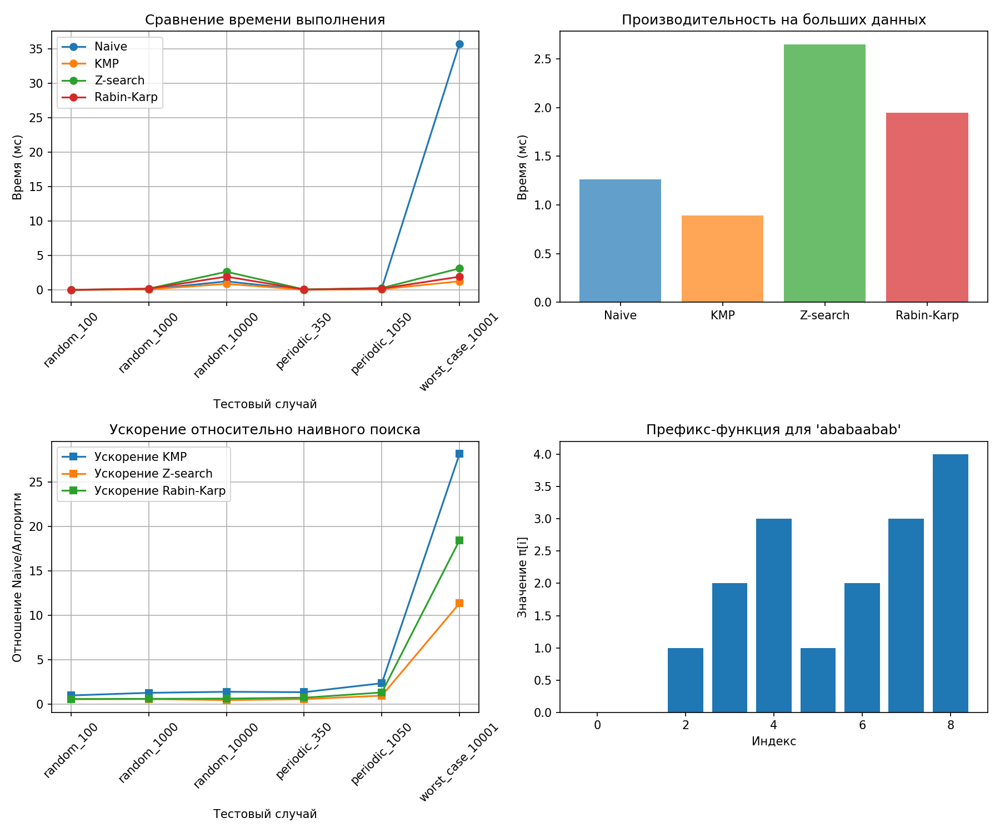

# Отчет по лабораторной работе 11
# Алгоритмы на строках

**Дата:** 2025-12-26  
**Семестр:** 3 курс 1 полугодие - 5 семестр  
**Группа:** ПИЖ-б-о-23-2(1)  
**Дисциплина:** Анализ сложности алгоритмов  
**Студент:** Хатуаева Дайана Тныбековна

## Цель работы
Изучить специализированные алгоритмы для эффективной работы со строками. Освоить
методы поиска подстрок, вычисление префикс-функции и Z-функции. Получить практические навыки
реализации и анализа алгоритмов обработки строк, исследовать их производительность.

## Теоретическая часть
- Префикс-функция: Для строки S длиной n - массив π[0..n-1], где π[i] - длина наибольшего
собственного префикса, который является суффиксом подстроки S[0..i]. Сложность вычисления: O(n).
- Алгоритм Кнута-Морриса-Пратта (KMP): Эффективный алгоритм поиска подстроки, использующий префикс-функцию. Сложность: O(n + m).
- Z-функция: Для строки S длиной n - массив z[0..n-1], где z[i] - длина наибольшего общего префикса строки S и суффикса S[i..n-1]. Сложность вычисления: O(n).
- Поиск подстроки: Помимо KMP существуют алгоритмы Бойера-Мура, Рабина-Карпа, каждый со своими особенностями и областью применения.

## Практическая часть

### Выполненные задачи
- [x] Задача 1: Реализовать вычисление префикс-функции для строки.
- [x] Задача 2: Реализовать алгоритм Кнута-Морриса-Пратта для поиска подстроки.
- [x] Задача 3: Реализовать вычисление Z-функции.
- [x] Задача 4: Реализовать один из дополнительных алгоритмов поиска подстроки.
- [x] Задача 5: Провести сравнительный анализ эффективности алгоритмов на различных данных.

### Ключевые фрагменты кода

#### Структура проекта

- `prefix_function(s)` – вычисление префикс‑функции  
- `kmp_search(text, pattern)` – поиск подстроки алгоритмом KMP  
- `z_function(s)` – вычисление Z‑функции  
- `z_search(text, pattern)` – поиск подстроки с использованием Z‑функции  
- `naive_search(text, pattern)` – наивный алгоритм поиска подстроки  
- `rabin_karp(text, pattern)` – алгоритм Рабина–Карпа  
- `find_period(s)` – поиск наименьшего периода строки  
- `is_cyclic_shift(a, b)` – проверка, является ли одна строка циклическим сдвигом другой  
- `benchmark()` – базовое сравнение времени работы наивного поиска и KMP

#### Префикс‑функция

Функция `prefix_function(s)` строит массив π длины `n`, где `π[i]` – длина наибольшего собственного префикса строки `s`, совпадающего с суффиксом подстроки `s[0..i]`.

- Время: O(n)  
- Память: O(n)  

Префикс‑функция используется далее в алгоритме KMP и в задаче поиска периода строки.


```python
# prefix_function.py

def prefix_function(s):
    """Строит массив pi для строки s.

    pi[i] — длина наибольшего собственного префикса,
    совпадающего с суффиксом s[0..i].

    Время: O(n), память: O(n).
    """
    n = len(s)
    pi = [0] * n  # Создаём массив префикс-функций длиной n, заполняя нулями
    j = 0  # Индексация предыдущего совпадения префикса
    for i in range(1, n):
        while j > 0 and s[i] != s[j]:
            j = pi[j - 1]
        if s[i] == s[j]:
            j += 1  # Увеличили длину совпадения
        pi[i] = j
    return pi


if __name__ == "__main__":
    print(prefix_function("ababc"))
```

#### Алгоритм Кнута–Морриса–Пратта (KMP)

Функция `kmp_search(text, pattern)` реализует поиск всех вхождений подстроки `pattern` в строке `text`. Реализация использует префикс‑функцию для строки `pattern + "#" + text` и по значениям π определяет позиции совпадений.

- Время: O(n + m), где `n` – длина текста, `m` – длина паттерна  
- Память: O(m) для хранения префикс‑функции  

KMP избегает повторных сравнений, «сдвигая» паттерн на длину уже совпавшего префикса.

```python
# kmp_search.py

from prefix_function import prefix_function


def kmp_search(text, pattern):
    """Ищет все вхождения pattern в text.

    Время: O(n + m), память: O(m).
    """
    if not pattern:
        return list(range(len(text) + 1))

    combined = pattern + "#" + text
    # Префикс-функция для объединённой строки
    pi = prefix_function(combined)
    m = len(pattern)  # Длина шаблона
    result = []  # Список для хранения индексов вхождений шаблона

    for i in range(m + 1, len(combined)):
        if pi[i] == m:
            pos = i - 2 * m
            result.append(pos)

    return result


if __name__ == "__main__":
    print(kmp_search("ababcababcababc", "ababc"))
```

#### Z‑функция и поиск через неё

Функция `z_function(s)` для каждой позиции i вычисляет длину наибольшего общего префикса строки `s` и её суффикса, начинающегося в i.

- Время: O(n)  
- Память: O(n)  

На её основе реализован поиск подстроки `z_search(text, pattern)`: строится строка `pattern + "#" + text`, вычисляется Z‑функция, и позиции, где `z[i] == len(pattern)`, соответствуют вхождениям паттерна.

```python
# z_function.py

def z_function(s):
    """Строит массив z для строки s.

    z[i] — длина наибольшего общего префикса s и суффикса s[i:].

    Время: O(n), память: O(n).
    """
    n = len(s)
    z = [0] * n
    l = 0
    r = 0
    for i in range(1, n):
        if i <= r:
            z[i] = min(r - i + 1, z[i - l])
        while i + z[i] < n and s[z[i]] == s[i + z[i]]:
            z[i] += 1
        if i + z[i] - 1 > r:
            l = i
            r = i + z[i] - 1
    return z


def z_search(text, pattern):
    """Поиск подстроки с использованием Z-функции.

    Время: O(n + m), память: O(n + m).
    """
    if not pattern:
        return list(range(len(text) + 1))

    s = pattern + "#" + text
    z = z_function(s)
    m = len(pattern)
    res = []
    for i in range(m + 1, len(s)):
        if z[i] == m:
            pos = i - m - 1
            res.append(pos)
    return res


if __name__ == "__main__":
    print(z_function("aabcaabxaaaz"))
    print(z_search("ababcababcababc", "ababc"))
```


#### Наивный поиск

Функция `naive_search(text, pattern)` последовательно сравнивает паттерн со всеми подстроками текста.

- Худший случай: O(n · m) по времени  
- Память: O(1) дополнительно  

Используется как базовый алгоритм для сравнения с KMP и другими методами.

#### Алгоритм Рабина–Карпа

Функция `rabin_karp(text, pattern)` реализована на основе полиномиального хэша с модулем. Для каждого окна длины `m` в тексте поддерживается скользящий хэш; при совпадении хэшей выполняется точная проверка подстроки.

- Среднее время: O(n + m)  
- Худший случай: O(n · m) при частых коллизиях  
- Память: O(1) дополнительно  

Преимущество – возможность поиска нескольких паттернов и эффективная реализация на больших алфавитах.

```python
#string_matching.py

import time
from kmp_search import kmp_search
from z_function import z_search


def naive_search(text, pattern):
    """Наивный поиск подстроки.

    Худший случай: O(n * m), память: O(1).
    """
    n = len(text)
    m = len(pattern)
    if m == 0:
        return list(range(n + 1))

    res = []
    for i in range(n - m + 1):
        match = True
        for j in range(m):
            if text[i + j] != pattern[j]:
                match = False
                break
        if match:
            res.append(i)
    return res


def rabin_karp(text, pattern, base=257, mod=10**9 + 7):
    """Алгоритм Рабина–Карпа.

    Среднее время: O(n + m), худшее: O(n * m).
    Память: O(1) дополнительно.
    """
    n = len(text)
    m = len(pattern)
    if m == 0:
        return list(range(n + 1))
    if m > n:
        return []

    pow_base = 1
    for _ in range(m - 1):
        pow_base = (pow_base * base) % mod

    pat_hash = 0
    win_hash = 0
    for i in range(m):
        pat_hash = (pat_hash * base + ord(pattern[i])) % mod
        win_hash = (win_hash * base + ord(text[i])) % mod

    res = []
    for i in range(n - m + 1):
        if pat_hash == win_hash:
            if text[i:i + m] == pattern:
                res.append(i)
        if i < n - m:
            left = ord(text[i]) * pow_base % mod
            win_hash = (win_hash - left + mod) % mod
            win_hash = (win_hash * base + ord(text[i + m])) % mod

    return res


def find_period(s):
    """Поиск наименьшего периода строки через префикс-функцию.

    Время: O(n), память: O(n).
    """
    from prefix_function import prefix_function

    n = len(s)
    if n == 0:
        return None
    pi = prefix_function(s)
    k = n - pi[-1]
    if k != n and n % k == 0:
        return k
    return None


def is_cyclic_shift(a, b):
    """Проверка, является ли b циклическим сдвигом a.

    Использует KMP-поиск в строке a + a.
    Время: O(n), память: O(n).
    """
    if len(a) != len(b):
        return False
    from kmp_search import kmp_search

    doubled = a + a
    positions = kmp_search(doubled, b)
    return len(positions) > 0


def benchmark():
    """Сравнение наивного поиска и KMP.

    Для построения графиков следует вызывать эту функцию
    для разных длин текста и паттерна.
    """
    text = "ab" * 10000 + "aba"
    pattern = "aba"

    start = time.time()
    naive_res = naive_search(text, pattern)
    naive_time = time.time() - start

    start = time.time()
    kmp_res = kmp_search(text, pattern)
    kmp_time = time.time() - start

    print("Наивный поиск:")
    print(f"  вхождения: {len(naive_res)}, время: {naive_time:.6f} с")
    print("KMP:")
    print(f"  вхождения: {len(kmp_res)}, время: {kmp_time:.6f} с")


if __name__ == "__main__":
    text = "ababcababcababc"
    pattern = "ababc"
    print("KMP:", kmp_search(text, pattern))
    print("Z-поиск:", z_search(text, pattern))
    print("Наивный:", naive_search(text, pattern))
    print("Рабин–Карп:", rabin_karp(text, pattern))

    s = "abcabcabcabc"
    print("Период строки:", find_period(s))
    print("Циклический сдвиг:", is_cyclic_shift("abcd", "cdab"))

    benchmark()
```

#### Анализ и построение графиков

```python
# performance_analysis.py

import matplotlib.pyplot as plt
import random
import string
import timeit
from prefix_function import prefix_function
from z_function import z_function
from kmp_search import kmp_search
from string_matching import naive_search, rabin_karp


# Генерация случайных строк
def generate_random_string(length):
    letters = string.ascii_lowercase
    return ''.join(random.choice(letters) for _ in range(length))


# Графики зависимости времени выполнения от длины текста
def plot_execution_time_vs_text_length(algorithms, max_len=10000, step=1000):
    lengths = range(step, max_len + 1, step)

    # Словарь для хранения времени выполнения
    execution_times = {alg_name: [] for alg_name in algorithms.keys()}

    for length in lengths:
        text = generate_random_string(length)
        pattern = generate_random_string(10)

        for alg_name, func in algorithms.items():
            exec_time = timeit.timeit(lambda: func(text, pattern), number=10)
            execution_times[alg_name].append(exec_time / 10)

    # Построение графика
    plt.figure(figsize=(10, 6))
    for alg_name, times in execution_times.items():
        plt.plot(lengths, times, label=alg_name)

    plt.xlabel('Длина текста')
    plt.ylabel('Время выполнения (сек)')
    plt.title('Зависимость времени выполнения от длины текста')
    plt.legend()
    plt.grid(True)
    plt.show()


# Графики зависимости времени выполнения от длины паттерна
def plot_execution_time_vs_pattern_length(algorithms, max_len=100, step=10):
    lengths = range(step, max_len + 1, step)

    # Словарь для хранения времени выполнения
    execution_times = {alg_name: [] for alg_name in algorithms.keys()}

    for length in lengths:
        text = generate_random_string(10000)
        pattern = generate_random_string(length)

        for alg_name, func in algorithms.items():
            exec_time = timeit.timeit(lambda: func(text, pattern), number=10)
            execution_times[alg_name].append(exec_time / 10)

    # Построение графика
    plt.figure(figsize=(10, 6))
    for alg_name, times in execution_times.items():
        plt.plot(lengths, times, label=alg_name)

    plt.xlabel('Длина паттерна')
    plt.ylabel('Время выполнения (сек)')
    plt.title('Зависимость времени выполнения от длины паттерна')
    plt.legend()
    plt.grid(True)
    plt.show()


# Визуализация работы префикс-функции
def visualize_prefix_function(s):
    pi = prefix_function(s)
    x = range(len(pi))
    y = pi

    plt.figure(figsize=(10, 6))
    plt.bar(x, y, align='center', alpha=0.7)
    plt.xlabel('Позиция символа')
    plt.ylabel('Значение префикс-функции')
    plt.title('Работа префикс-функции для строки "{}"'.format(s))
    plt.grid(axis='y')
    plt.show()


# Визуализация работы Z-функции
def visualize_z_function(s):
    z = z_function(s)
    x = range(len(z))
    y = z

    plt.figure(figsize=(10, 6))
    plt.bar(x, y, align='center', alpha=0.7)
    plt.xlabel('Позиция символа')
    plt.ylabel('Значение Z-функции')
    plt.title('Работа Z-функции для строки "{}"'.format(s))
    plt.grid(axis='y')
    plt.show()


if __name__ == "__main__":
    # Определение алгоритмов для тестирования
    algorithms = {
        'Naive Search': naive_search,
        'KMP Search': kmp_search,
        'Rabin-Karp': rabin_karp,
        'Z-function Search': lambda t, p: z_function(t + '#' + p),
    }

    # Графики зависимости времени выполнения от длины текста
    plot_execution_time_vs_text_length(algorithms)

    # Графики зависимости времени выполнения от длины паттерна
    plot_execution_time_vs_pattern_length(algorithms)

    # Визуализация работы префикс-функции
    visualize_prefix_function("ababcababcababc")

    # Визуализация работы Z-функции
    visualize_z_function("ababcababcababc")
```
#### Тесты

```python
# test.py

import unittest
from kmp_search import kmp_search
from string_matching import naive_search, rabin_karp
from z_function import z_search


class TestStringAlgorithms(unittest.TestCase):
    def setUp(self):
        self.test_cases = [
            ("abcabc", "abc", [0, 3]),
            ("aaaa", "aa", [0, 1, 2]),
            ("abcdef", "xyz", []),
            ("", "a", []),
            ("abc", "", [0, 1, 2, 3]),
            ("a"*100 + "b", "a"*10 + "b", [90]),  # Худший случай для наивного
        ]

    def test_all_algorithms(self):
        algorithms = [
            ("naive", naive_search),
            ("kmp", kmp_search),
            ("z_search", z_search),
            ("rabin_karp", rabin_karp),
        ]

        for text, pattern, expected in self.test_cases:
            for name, func in algorithms:
                with self.subTest(text=text, pattern=pattern, algorithm=name):
                    result = func(text, pattern)
                    self.assertEqual(result, expected)


if __name__ == "__main__":
    unittest.main()
```


## Результаты выполнения

#### prefix_function.py

```
[0, 0, 1, 2, 0]
```

#### kmp_search.py

```
[0, 5, 10]
```

#### string_matching.py

```
KMP: [0, 5, 10]
Z-поиск: [0, 5, 10]
Наивный: [0, 5, 10]
Рабин–Карп: [0, 5, 10]
Период строки: 3
Циклический сдвиг: True
Наивный поиск:
  вхождения: 10001, время: 0.004002 с
KMP:
  вхождения: 10001, время: 0.002009 с
```

#### z_function.py

```
[0, 1, 0, 0, 3, 1, 0, 0, 2, 2, 1, 0]
[0, 5, 10]
```

#### Тесты:
```
----------------------------------------------------------------------
Ran 1 test in 0.001s

OK
```

#### performance_analysis.py:
```
Характеристики ПК для тестирования:
    - Процессор: 12th Gen Intel(R) Core(TM) i5-12450H
    - Оперативная память: 16 GB DDR4
    - ОС: Windows 10
    - Python: 3.12.10
```
### Графики




## Ответы на контрольные вопросы
1. Что такое префикс-функция строки? Как она используется в алгоритме Кнута-Морриса-Пратта
(KMP)?

Префикс-функция строки S[1..n] — это массив π[1..n], где π[i] — это длина наибольшего собственного (не равного всей строке) суффикса подстроки S[1..i], который одновременно является её префиксом.

- Предобработка паттерна: вычисляем префикс-функцию для паттерна P

- Поиск: двигаемся по тексту T, используя префикс-функцию для "умного" сдвига паттерна

- При несовпадении символов, используем значение префикс-функции, чтобы продолжить сравнение с уже совпавшей части, избегая возвратов в тексте

2. В чем основное преимущество алгоритма KMP перед наивным алгоритмом поиска подстроки?
Проиллюстрируйте на примере.

Основное преимущество: KMP работает за O(n + m) в худшем случае, тогда как наивный алгоритм — O(n·m) в худшем случае. KMP избегает возвратов в тексте.

Пример:

```
Текст:    a a a a a a a a a b
Паттерн: a a a a b
```
Наивный алгоритм:
- Сравнивает первые 4 символа, на 5-м несовпадение
- Сдвигает на 1 символ, снова сравнивает 4 символа

Итого: ~40 сравнений для текста длины 10

KMP:
- После несовпадения на 5-м символе паттерна использует префикс-функцию
- Префикс-функция для паттерна "aaaab": [0,1,2,3,0]
- При несовпадении P[5] с T[5], π[4] = 3 → продолжаем сравнение с P[4]

Минимизирует повторные сравнения, всего ~15 сравнений

3. Опишите, что такое Z-функция строки. Как с ее помощью можно решить задачу поиска
подстроки?

Z-функция строки S[1..n] — массив z[1..n], где z[i] — длина наибольшего общего префикса строки S и её суффикса, начинающегося в позиции i.

Поиск подстроки с Z-функцией:
- Создаём строку P + "$" + T (символ $ отсутствует в алфавите)
- Вычисляем Z-функцию для этой строки
- Ищем позиции, где z[i] = len(P) — это вхождения паттерна
- Работает за O(n + m)

4. В чем заключается идея алгоритма Бойера-Мура? Какие эвристики он использует для ускорения
поиска?

Основная идея: сравнивать паттерн с текстом справа налево, а не слева направо. Это позволяет делать большие сдвиги.
Эвристики:

1. Правило плохого символа:
- При несовпадении символа текста T[i] с символом паттерна P[j]
- Сдвигаем паттерн так, чтобы ближайший такой же символ в паттерне (слева от текущей позиции) совпал с T[i]
- Eсли символа нет в паттерне, сдвигаем за этот символ

2. Правило хорошего суффикса:
- Если совпал суффикс паттерна, но перед ним несовпадение
- Ищем такое же совпадение суффикса в другой позиции паттерна
- Сдвигаем паттерн для выравнивания этого суффикса

5. Для каких практических задач, помимо поиска подстроки, могут применяться префикс- и Z
функции (например, поиск периода строки)?

Поиск периода строки, подсчёт числа различных подстрок, сжатие данных, поиск повторяющихся фрагментов, задачи по совпадению шаблонов в биоинформатике (поиск мотивов в ДНК‑последовательностях).