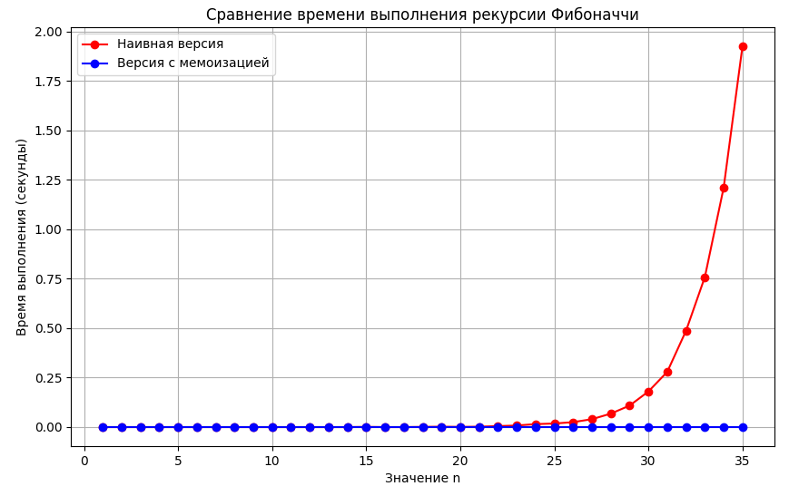

# Отчет по лабораторной работе 3
# Рекурсия

**Дата:** 2025-11-01  
**Семестр:** 3 курс 1 полугодие - 5 семестр  
**Группа:** ПИЖ-б-о-23-2(1)  
**Дисциплина:** Анализ сложности алгоритмов  
**Студент:** Хатуаева Дайана Тныбековна

## Цель работы
Освоить принцип рекурсии, научиться анализировать рекурсивные алгоритмы и понимать механизм работы стека вызовов. Изучить типичные задачи, решаемые рекурсивно, и освоить технику мемоизации для оптимизации рекурсивных алгоритмов. Получить практические навыки реализации и отладки рекурсивных функций.

## Теоретическая часть
- Рекурсия: Процесс, при котором функция прямо или косвенно вызывает саму себя для решения задачи.
- Базовый случай (условие выхода): Обязательное условие, которое прекращает рекурсивные вызовы и предотвращает зацикливание.
- Рекурсивный шаг: Шаг, на котором задача разбивается на более простую подзадачу того же типа и производится рекурсивный вызов.
- Глубина рекурсии: Количество вложенных вызовов функции. Ограничена размером стека вызовов.
- Стек вызовов (Call Stack): Структура данных, которая хранит информацию о незавершенных вызовах функций (локальные переменные, адрес возврата).
- Мемоизация (Memoization): Техника оптимизации, позволяющая избежать повторных вычислений результатов функций для одних и тех же входных данных путем сохранения ранее вычисленных результатов в кеше (например, в словаре)

## Практическая часть

### Выполненные задачи
- [x] Задача 1: Реализовать классические рекурсивные алгоритмы.
- [x] Задача 2: Проанализировать их временную сложность и глубину рекурсии.
- [x] Задача 3: Реализовать оптимизацию рекурсивных алгоритмов с помощью мемоизации.
- [x] Задача 4: Сравнить производительность наивной рекурсии и рекурсии с мемоизацией.
- [x] Задача 5: Решить практические задачи с применением рекурсии.

### Ключевые фрагменты кода
####  Реализация рекурсивных алгоритмов
```python
# recursion.py
import os
from typing import List, Optional


# 1. Бинарный поиск с рекурсией
def binary_search_recursive(arr: List[int], target: int,
                            left: int = 0, right: int = None) -> Optional[int]:
    """
    Рекурсивная реализация бинарного поиска

    Временная сложность: O(log n)
    Глубина рекурсии: O(log n)

    Args:
        arr: отсортированный список целых чисел
        target: искомый элемент
        left: левая граница поиска
        right: правая граница поиска

    Return:
        Индекс элемента или None, если элемент не найден
    """
    if right is None:
        right = len(arr) - 1

    # Базовый случай: элемент не найден
    if left > right:
        return None

    # Вычисляем середину
    mid = (left + right) // 2

    # Базовый случай: элемент найден
    if arr[mid] == target:
        return mid

    # Рекурсивный шаг: ищем в левой или правой половине
    elif arr[mid] > target:
        return binary_search_recursive(arr, target, left, mid - 1)
    else:
        return binary_search_recursive(arr, target, mid + 1, right)


# 2. Рекурсивный обход файловой системы
def traverse_filesystem(path: str, indent: int = 0, max_depth: int = None,
                        current_depth: int = 0) -> None:
    """
    Рекурсивный обход файловой системы с выводом дерева каталогов

    Args:
        path: начальный путь для обхода
        indent: отступ для визуализации иерархии
        max_depth: максимальная глубина рекурсии (для исследования)
        current_depth: текущая глубина рекурсии
    """
    if max_depth is not None and current_depth > max_depth:
        return

    try:
        # Получаем список элементов в директории
        items = os.listdir(path)
    except PermissionError:
        print(" " * indent + "[Доступ запрещен]")
        return
    except FileNotFoundError:
        print(" " * indent + "[Путь не найден]")
        return

    for item in sorted(items):
        item_path = os.path.join(path, item)

        if os.path.isdir(item_path):
            # Это директория - выводим и рекурсивно обходим
            print(" " * indent + f" {item}/")
            traverse_filesystem(item_path, indent + 2, max_depth, current_depth + 1)
        else:
            # Это файл - просто выводим
            print(" " * indent + f" {item}")


# 3. Ханойские башни
def hanoi_towers(n: int, source: str = "A",
                 auxiliary: str = "B", target: str = "C") -> List[str]:
    """
    Решение задачи "Ханойские башни"

    Временная сложность: O(2^n)
    Глубина рекурсии: O(n)

    Args:
        n: количество дисков
        source: начальный стержень
        auxiliary: вспомогательный стержень
        target: целевой стержень

    Returns:
        Список ходов для решения задачи
    """
    moves = []

    def _hanoi(n: int, source: str, auxiliary: str, target: str):
        # Базовый случай: перемещаем один диск
        if n == 1:
            moves.append(f"Переместить диск 1 с {source} на {target}")
            return

        # Рекурсивный шаг:
        # 1. Переместить n-1 дисков на вспомогательный стержень
        _hanoi(n - 1, source, target, auxiliary)

        # 2. Переместить самый большой диск на целевой стержень
        moves.append(f"Переместить диск {n} с {source} на {target}")

        # 3. Переместить n-1 дисков с вспомогательного на целевой стержень
        _hanoi(n - 1, auxiliary, source, target)

    _hanoi(n, source, auxiliary, target)
    return moves


# Функции для экспериментов
def measure_max_recursion_depth(start_path: str = ".") -> int:
    """
    Измерение максимальной глубины рекурсии при обходе файловой системы
    """
    max_depth = [0]

    def _traverse_measure(path: str, current_depth: int):
        max_depth[0] = max(max_depth[0], current_depth)

        try:
            for item in os.listdir(path):
                item_path = os.path.join(path, item)
                if os.path.isdir(item_path):
                    _traverse_measure(item_path, current_depth + 1)
        except (PermissionError, FileNotFoundError):
            pass

    _traverse_measure(start_path, 0)
    return max_depth[0]


def test_binary_search():
    """Тестирование бинарного поиска"""
    print("=" * 60)
    print("Тестирование бинарного поиска")
    print("=" * 60)

    arr = [1, 3, 5, 7, 9, 11, 13, 15, 17, 19]
    targets = [7, 1, 19, 8]

    for target in targets:
        result = binary_search_recursive(arr, target)
        if result is not None:
            print(f"Элемент {target} найден по индексу {result}")
        else:
            print(f"Элемент {target} не найден")


def test_hanoi_towers():
    """Тестирование Ханойских башен"""
    print("\n" + "=" * 60)
    print("Решение задачи 'Ханойские башни' для 3 дисков")
    print("=" * 60)

    moves = hanoi_towers(3)
    for i, move in enumerate(moves, 1):
        print(f"{i}. {move}")


def test_filesystem_traversal():
    """Тестирование обхода файловой системы"""
    print("\n" + "=" * 60)
    print("Обход файловой системы (ограничен глубиной 3)")
    print("=" * 60)

    # Ограничиваем глубину для наглядности
    traverse_filesystem(".", max_depth=3)


if __name__ == "__main__":
    test_binary_search()
    test_hanoi_towers()
    test_filesystem_traversal()

    # Измерение максимальной глубины рекурсии
    print("\n" + "=" * 60)
    print("Измерение максимальной глубины рекурсии")
    print("=" * 60)

    max_depth = measure_max_recursion_depth(".")
    print(f"Максимальная глубина рекурсии при обходе текущей директории: {max_depth}")
```

#### Оптимизация с помощью мемоизации
```python
# memoization.py
from typing import Dict
import time
import matplotlib.pyplot as plt

# Для отслеживания количества вызовов
call_count = 0
memo_call_count = 0

# Характеристики ПК
pc_info = """
    Характеристики ПК для тестирования:
    - Процессор: 12th Gen Intel(R) Core(TM) i5-12450H
    - Оперативная память: 16 GB DDR4
    - ОС: Windows 10
    - Python: 3.12.10
    """
print(pc_info)


def fibonacci_naive(n: int) -> int:
    """
    Вычисление n-го числа Фибоначчи (наивная версия)
    """
    global call_count
    call_count += 1

    if n < 0:
        raise ValueError("Число Фибоначчи для отрицательного индекса не определено")

    # Базовые случаи
    if n == 0:
        return 0
    if n == 1:
        return 1

    # Рекурсивный шаг
    return fibonacci_naive(n - 1) + fibonacci_naive(n - 2)


def fibonacci_memoized(n: int, memo: Dict[int, int] = None) -> int:
    """
    Оптимизированная версия с мемоизацией
    Временная сложность: O(n)
    """
    global memo_call_count
    memo_call_count += 1

    if n < 0:
        raise ValueError("Число Фибоначчи для отрицательного индекса не определено")

    if memo is None:
        memo = {0: 0, 1: 1}

    # Если результат уже вычислен, возвращаем его
    if n in memo:
        return memo[n]

    # Вычисляем и сохраняем результат
    memo[n] = fibonacci_memoized(n - 1, memo) + fibonacci_memoized(n - 2, memo)
    return memo[n]


def compare_fibonacci():
    """Сравнение производительности наивной и мемоизированной версий"""
    n = 35

    print("=" * 60)
    print("Сравнение вычисления числа Фибоначчи для n = 35")
    print("=" * 60)

    # Сброс счётчиков
    global call_count, memo_call_count
    call_count = 0
    memo_call_count = 0

    # Наивная версия
    start_time = time.time()
    result_naive = fibonacci_naive(n)
    naive_time = time.time() - start_time

    print("\nНаивная рекурсия:")
    print(f"  Результат: {result_naive}")
    print(f"  Время выполнения: {naive_time:.6f} секунд")
    print(f"  Количество рекурсивных вызовов: {call_count:,}")

    # Мемоизированная версия
    start_time = time.time()
    result_memo = fibonacci_memoized(n)
    memo_time = time.time() - start_time

    print("\nС мемоизацией:")
    print(f"  Результат: {result_memo}")
    print(f"  Время выполнения: {memo_time:.6f} секунд")
    print(f"  Количество рекурсивных вызовов: {memo_call_count:,}")

    print(f"Сокращение вызовов: {call_count/memo_call_count:.2f} раз")


# Экспериментальное исследование для разных n
def measure_for_different_n():
    """Замер времени выполнения для разных n"""
    test_values = list(range(1, 36))

    # Массивы для хранения временных метрик
    times_naive = []
    times_memoized = []

    for n in test_values:
        # Наивная версия
        start_time = time.time()
        fibonacci_naive(n)
        naive_time = time.time() - start_time

        # Версия с мемоизацией
        start_time = time.time()
        fibonacci_memoized(n)
        memo_time = time.time() - start_time

        # Добавляем результаты измерений
        times_naive.append(naive_time)
        times_memoized.append(memo_time)

    # Строим график
    plt.figure(figsize=(10, 6))
    plt.plot(test_values, times_naive, 'ro-', label='Наивная версия')
    plt.plot(test_values, times_memoized, 'bo-', label='Версия с мемоизацией')

    plt.title('Сравнение времени выполнения рекурсии Фибоначчи')
    plt.xlabel('Значение n')
    plt.ylabel('Время выполнения (секунды)')
    plt.legend(loc='upper left')
    plt.grid(True)
    plt.show()


if __name__ == "__main__":
    compare_fibonacci()
    measure_for_different_n()
```

####  Решение практических задач
```python
# recursion_tasks.py
import os
from typing import List, Optional


# 1. Бинарный поиск с рекурсией
def binary_search_recursive(arr: List[int], target: int,
                            left: int = 0, right: int = None) -> Optional[int]:
    """
    Рекурсивная реализация бинарного поиска

    Временная сложность: O(log n)
    Глубина рекурсии: O(log n)

    Args:
        arr: отсортированный список целых чисел
        target: искомый элемент
        left: левая граница поиска
        right: правая граница поиска

    Return:
        Индекс элемента или None, если элемент не найден
    """
    if right is None:
        right = len(arr) - 1

    # Базовый случай: элемент не найден
    if left > right:
        return None

    # Вычисляем середину
    mid = (left + right) // 2

    # Базовый случай: элемент найден
    if arr[mid] == target:
        return mid

    # Рекурсивный шаг: ищем в левой или правой половине
    elif arr[mid] > target:
        return binary_search_recursive(arr, target, left, mid - 1)
    else:
        return binary_search_recursive(arr, target, mid + 1, right)


# 2. Рекурсивный обход файловой системы
def traverse_filesystem(path: str, indent: int = 0, max_depth: int = None,
                        current_depth: int = 0) -> None:
    """
    Рекурсивный обход файловой системы с выводом дерева каталогов

    Args:
        path: начальный путь для обхода
        indent: отступ для визуализации иерархии
        max_depth: максимальная глубина рекурсии (для исследования)
        current_depth: текущая глубина рекурсии
    """
    if max_depth is not None and current_depth > max_depth:
        return

    try:
        # Получаем список элементов в директории
        items = os.listdir(path)
    except PermissionError:
        print(" " * indent + "[Доступ запрещен]")
        return
    except FileNotFoundError:
        print(" " * indent + "[Путь не найден]")
        return

    for item in sorted(items):
        item_path = os.path.join(path, item)

        if os.path.isdir(item_path):
            # Это директория - выводим и рекурсивно обходим
            print(" " * indent + f"📁 {item}/")
            traverse_filesystem(item_path, indent + 2, max_depth, current_depth + 1)
        else:
            # Это файл - просто выводим
            print(" " * indent + f"📄 {item}")


# 3. Ханойские башни
def hanoi_towers(n: int, source: str = "A",
                 auxiliary: str = "B", target: str = "C") -> List[str]:
    """
    Решение задачи "Ханойские башни"

    Временная сложность: O(2^n)
    Глубина рекурсии: O(n)

    Args:
        n: количество дисков
        source: начальный стержень
        auxiliary: вспомогательный стержень
        target: целевой стержень

    Returns:
        Список ходов для решения задачи
    """
    moves = []

    def _hanoi(n: int, source: str, auxiliary: str, target: str):
        # Базовый случай: перемещаем один диск
        if n == 1:
            moves.append(f"Переместить диск 1 с {source} на {target}")
            return

        # Рекурсивный шаг:
        # 1. Переместить n-1 дисков на вспомогательный стержень
        _hanoi(n - 1, source, target, auxiliary)

        # 2. Переместить самый большой диск на целевой стержень
        moves.append(f"Переместить диск {n} с {source} на {target}")

        # 3. Переместить n-1 дисков с вспомогательного на целевой стержень
        _hanoi(n - 1, auxiliary, source, target)

    _hanoi(n, source, auxiliary, target)
    return moves


# Функции для экспериментов
def measure_max_recursion_depth(start_path: str = ".") -> int:
    """
    Измерение максимальной глубины рекурсии при обходе файловой системы
    """
    max_depth = [0]

    def _traverse_measure(path: str, current_depth: int):
        max_depth[0] = max(max_depth[0], current_depth)

        try:
            for item in os.listdir(path):
                item_path = os.path.join(path, item)
                if os.path.isdir(item_path):
                    _traverse_measure(item_path, current_depth + 1)
        except (PermissionError, FileNotFoundError):
            pass

    _traverse_measure(start_path, 0)
    return max_depth[0]


def test_binary_search():
    """Тестирование бинарного поиска"""
    print("=" * 60)
    print("Тестирование бинарного поиска")
    print("=" * 60)

    arr = [1, 3, 5, 7, 9, 11, 13, 15, 17, 19]
    targets = [7, 1, 19, 8]

    for target in targets:
        result = binary_search_recursive(arr, target)
        if result is not None:
            print(f"Элемент {target} найден по индексу {result}")
        else:
            print(f"Элемент {target} не найден")


def test_hanoi_towers():
    """Тестирование Ханойских башен"""
    print("\n" + "=" * 60)
    print("Решение задачи 'Ханойские башни' для 3 дисков")
    print("=" * 60)

    moves = hanoi_towers(3)
    for i, move in enumerate(moves, 1):
        print(f"{i}. {move}")


def test_filesystem_traversal():
    """Тестирование обхода файловой системы"""
    print("\n" + "=" * 60)
    print("Обход файловой системы (ограничен глубиной 3)")
    print("=" * 60)

    # Ограничиваем глубину для наглядности
    traverse_filesystem(".", max_depth=3)


if __name__ == "__main__":
    test_binary_search()
    test_hanoi_towers()
    test_filesystem_traversal()

    # Измерение максимальной глубины рекурсии
    print("\n" + "=" * 60)
    print("Измерение максимальной глубины рекурсии")
    print("=" * 60)

    max_depth = measure_max_recursion_depth(".")
    print(f"Максимальная глубина рекурсии при обходе текущей директории: {max_depth}")
```

## Результаты выполнения

### Пример работы программы
```
Характеристики ПК для тестирования:
    - Процессор: 12th Gen Intel(R) Core(TM) i5-12450H
    - Оперативная память: 16 GB DDR4
    - ОС: Windows 10
    - Python: 3.12.10

============================================================
Сравнение вычисления числа Фибоначчи для n = 35
============================================================

Наивная рекурсия:
  Результат: 9227465
  Время выполнения: 1.911905 секунд
  Количество рекурсивных вызовов: 29,860,703

С мемоизацией:
  Результат: 9227465
  Время выполнения: 0.000000 секунд
  Количество рекурсивных вызовов: 69
Сокращение вызовов: 432763.81 раз
```

```
Обход файловой системы (ограничен глубиной 3)
============================================================
.gitignore
README.md
report/
  memoizaition.PNG
report.md
src/
  memoization.py
  recursion.py
  recursion_tasks.py
venv/
  Include/
  Lib/
    site-packages/
      pip/
      pip-25.0.1.dist-info/
  Scripts/
    Activate.ps1
    activate
    activate.bat
    deactivate.bat
    pip.exe
    pip3.12.exe
    pip3.exe
    python.exe
    pythonw.exe
  pyvenv.cfg

============================================================
Измерение максимальной глубины рекурсии
============================================================
Максимальная глубина рекурсии при обходе текущей директории: 9
```


## Ответы на контрольные вопросы
1. Что такое базовый случай и рекурсивный шаг в рекурсивной функции? Почему отсутствие базового случая приводит к ошибке?

Базовый случай — это условие, при котором функция возвращает результат напрямую, не вызывая себя рекурсивно. Он предотвращает бесконечную рекурсию.

Рекурсивный шаг — часть функции, где она вызывает саму себя с измененными аргументами, приближаясь к базовому случаю.

Отсутствие базового случая приводит к бесконечной рекурсии, которая вызывает переполнение стека вызовов (Stack Overflow), так как каждый рекурсивный вызов добавляет новый кадр в стек, и память исчерпывается.

2. Объясните, как работает механизм мемоизации. Как он меняет временную сложность вычисления чисел Фибоначчи по сравнению с наивной рекурсией?

Мемоизация — это техника оптимизации, при которой результаты дорогостоящих вызовов функций сохраняются в кэше (например, в словаре) и возвращаются при повторных вызовах с теми же аргументами.

Для чисел Фибоначчи:

Наивная рекурсия: O(2ⁿ) — экспоненциальная сложность из-за повторных вычислений одних и тех же значений.

С мемоизацией: O(n) — линейная сложность, так как каждое значение вычисляется только один раз.

3. В чем заключается основная проблема глубокой рекурсии и как она связана со стеком вызовов?

Проблема заключается в том, что каждый рекурсивный вызов добавляет новый кадр (frame) в стек вызовов, содержащий локальные переменные и адрес возврата. При глубокой рекурсии стек может переполниться.

Связь такая, что стек вызовов имеет ограниченный размер (обычно 1-8 МБ). При превышении этого лимита возникает ошибка Stack Overflow.

4. Задача о Ханойских башнях решается рекурсивно. Опишите алгоритм решения для 3 дисков.

Рекурсивный алгоритм:
- Переместить 2 верхних диска с A на B (используя C как вспомогательный)
- Переместить самый большой диск с A на C
- Переместить 2 диска с B на C (используя A как вспомогательный)

5. Рекурсивный и итеративный алгоритмы могут решать одни и те же задачи. Назовите преимущества и недостатки каждого подхода.

Преимущества рекурсивного подхода:
- Более читаемый и лаконичный код для задач с рекурсивной природой
- Естественно отражает математические определения
- Упрощает решение сложных задач

Недостатки:
- Риск переполнения стека при глубокой рекурсии
- Большие накладные расходы на вызовы функций
- Может быть менее эффективен по памяти и времени

Преимущества итеративного подхода:
- Обычно эффективнее по памяти (не использует стек вызовов)
- Часто быстрее из-за отсутствия накладных расходов на вызовы функций
- Нет риска переполнения стека

Недостатки:
- Код может быть сложнее для понимания и написания
- Не всегда естественно отражает логику решения
