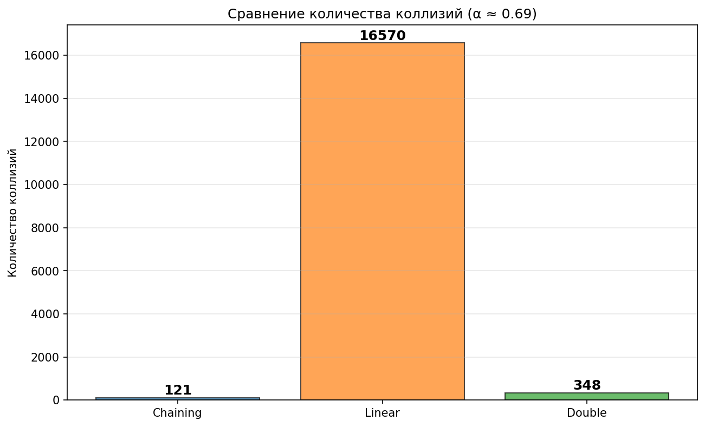
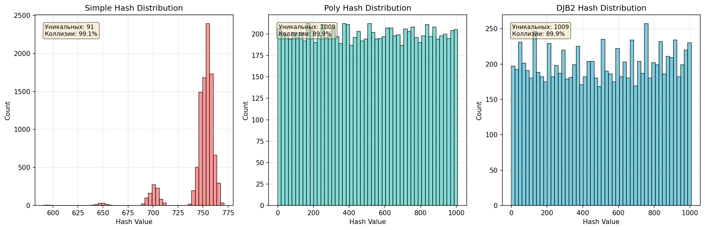
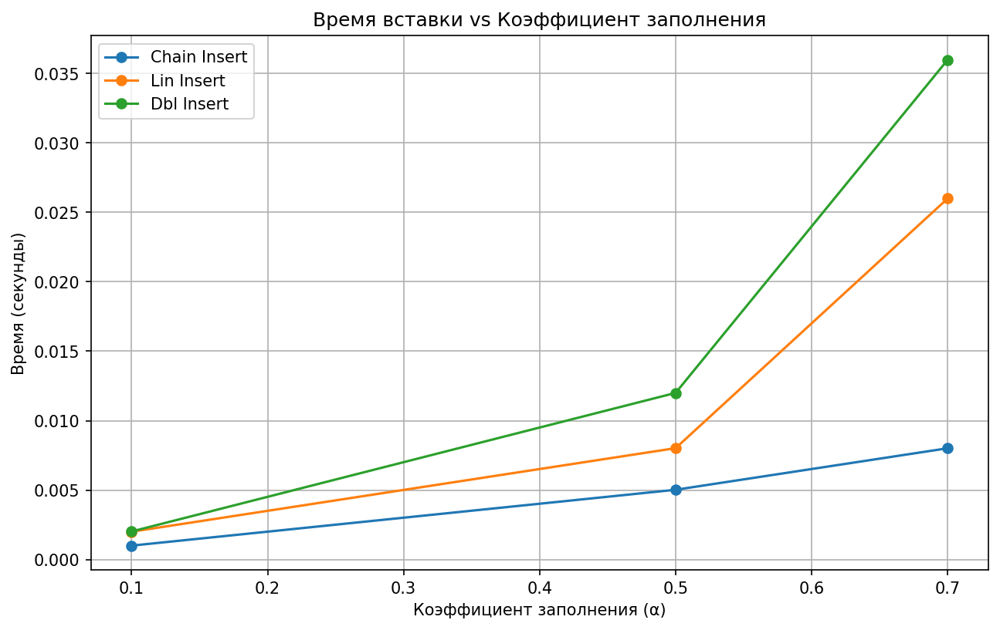
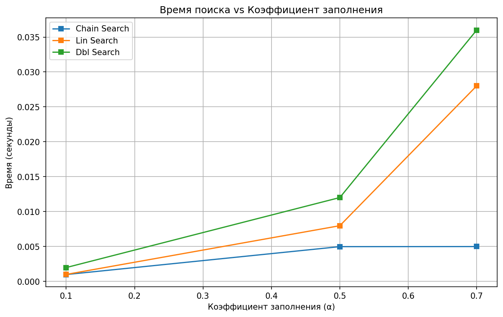

# Отчет по лабораторной работе 5
# Хеш-функции и хеш-таблицы

**Дата:** 2025-11-01  
**Семестр:** 3 курс 1 полугодие - 5 семестр  
**Группа:** ПИЖ-б-о-23-2(1)  
**Дисциплина:** Анализ сложности алгоритмов  
**Студент:** Хатуаева Дайана Тныбековна

## Цель работы
Изучить принципы работы хеш-функций и хеш-таблиц. Освоить методы разрешения коллизий. Получить практические навыки реализации хеш-таблицы с различными стратегиями разрешения коллизий. Провести сравнительный анализ эффективности разных методов.

## Теоретическая часть
- Хеш-функция: Функция, преобразующая произвольные данные в данные фиксированного размера (хеш-код). Требования: детерминированность, равномерное распределение, скорость вычисления.
- Хеш-таблица: Структура данных, реализующая ассоциативный массив. Обеспечивает в среднем O(1) для операций вставки, поиска и удаления.
- Коллизия: Ситуация, когда разные ключи имеют одинаковый хеш-код.
- Метод цепочек (Chaining): Каждая ячейка таблицы содержит список элементов с одинаковым хешем. Сложность: O(1 + α), где α - коэффициент заполнения.
- Открытая адресация (Open Addressing): Все элементы хранятся в самом массиве. При коллизии ищется следующая свободная ячейка согласно probe sequence.
- Двойное хеширование (Double Hashing): Метод открытой адресации, использующий вторую хеш-функцию для определения шага probing.

## Практическая часть

### Выполненные задачи
- [x] Задача 1: Реализовать несколько хеш-функций для строковых ключей.
- [x] Задача 2: Реализовать хеш-таблицу с методом цепочек.
- [x] Задача 3: Реализовать хеш-таблицу с открытой адресацией (линейное пробирование и двойное хеширование).
- [x] Задача 4: Провести сравнительный анализ эффективности разных методов разрешения коллизий.
- [x] Задача 5: Исследовать влияние коэффициента заполнения на производительность.

### Ключевые фрагменты кода

#### Реализация простой хеш-функции (сумма кодов символов)
Ниже представлена функция, которая возвращает результат таким образом, что обеспечивается попадание значения в диапазон размера таблицы.

```python
def simple(key: Union[str, bytes], table_size: int) -> int:
    """
    Простейшая хеш-функция: сумма ASCII-кодов символов.

    Сложность: O(n), где n - длина ключа

    Args:
        key: Входная строка или байты для хеширования
        table_size: Размер хеш-таблицы (модуль для конечного результата)

    Returns:
        Хеш-значение в диапазоне [0, table_size-1]
    """
    hash_value = 0  # Инициализация результата
    for _ in key:
        hash_value += ord(_)  # Прибавляем ASCII-код символа
    return hash_value % table_size
```

#### Полиномиальная хеш-функция
Принцип работы: каждый символ умножается на основание в определённой степени:  h = s[0]*b^0 + s[1]*b^1 + s[2]*b^2 + ... + s[n-1]*b^(n-1)

```python
def poly(key: Union[str, bytes],
         table_size: int,
         base: int = 31,
         large_prime: int = 10**9 + 7) -> int:
    """
    Полиномиальная rolling hash функция.

    Сложность: O(n), где n - длина ключа

    Args:
        key: Входная строка для хеширования
        table_size: Размер хеш-таблицы
        base: Основание полинома
        large_prime: Большое простое число для предотвращения переполнения

    Returns:
        Хеш-значение в диапазоне [0, table_size-1]
    """
    hash_value = 0  # Инициализация полиномиального хеша
    power = 1       # Текущая степень основания (base^0 = 1)

    for _ in key:
        hash_value = (hash_value + ord(_) * power) % large_prime

        # Обновляем степень для следующего символа
        power = (power * base) % large_prime

    return hash_value % table_size
```

#### Хеш-функция DJB2
Принцип работы: начинаем с магического числа 5381 и для каждого символа: h = h * 33 + char_code  
Формула: h = ((h << 5) + h) + c, что эквивалентно h * 33 + c

```python
def djb2(key: Union[str, bytes], table_size: int) -> int:
    """
    Хеш-функция DJB2

    Сложность: O(n), где n - длина ключа

    Args:
        key: Входная строка для хеширования
        table_size: Размер хеш-таблицы

    Returns:
        Хеш-значение в диапазоне [0, table_size-1]
    """
    # Инициализация магическим числом 5381
    hash_value = 5381

    for char in key:
        # Берём модуль на каждом шаге для предотвращения переполнения
        hash_value = ((hash_value << 5) + hash_value + ord(char)) % table_size

    return hash_value
```

### Сравнительная таблица хеш-функций

| Критерий          | simple()      | poly()         | djb2()        |
|-------------------|---------------|----------------|---------------|
| Сложность         | O(n)          | O(n)           | O(n)          |
| Качество          | Плохое        | Хорошее        | Отличное      |
| Скорость          | Быстрая       | Средняя        | Быстрая       |
| Коллизии          | Частые        | Редкие         | Очень редкие  |
| Память            | O(1)          | O(1)           | O(1)          |
| Учёт порядка      | Нет           | Да             | Да            |

#### Реализация хеш-таблиц:
- Метод цепочек с динамическим масштабированием

Далее представлено содержимое hash_table_chaining.py с комментариями к коду. В качестве хеш-функции используется DJB2.

```python
# hash_table_chaining.py
from hash_functions import djb2

from hash_functions import djb2


class HashTableChaining:
    """Хеш-таблица с разрешением коллизий методом цепочек."""
    def __init__(self, sz: int = 1009, hf=djb2) -> None:
        """
        Инициализация таблицы. Сложность: O(sz)

        Args:
            sz: Начальный размер таблицы (простое число)
            hf: Хеш-функция, принимает ключ и размер таблицы, возвращает индекс
        """
        self.sz = sz  # Размер таблицы
        self.tbl = [[] for _ in range(sz)]  # Массив списков для цепочек
        self.hf = hf  # Ссылка на хеш-функцию
        self.cnt = 0  # Счётчик элементов
        self.col = 0  # Счётчик коллизий

    def _lf(self) -> float:
        """
        Вычисление коэффициента заполнения (load factor). Сложность: O(1)

        Returns:
            Коэффициент заполнения таблицы (α = cnt / sz)
        """
        return self.cnt / self.sz

    def _res(self) -> None:
        """
        Увеличение размера таблицы при α > 0.7. Сложность: O(n)
        Производит перехеширование всех существующих элементов
        """
        old = self.tbl  # Сохраняем старую таблицу
        self.sz = self.sz * 2 + 1  # Новый размер (нечётное число)
        self.tbl = [[] for _ in range(self.sz)]
        self.cnt = 0  # Сбрасываем счетчик
        for ch in old:  # Перебираем все цепочки
            for key, value in ch:  # Перебираем пары в цепочке
                self.ins(key, value)  # Перехешируем в новую таблицу

    def ins(self, key, value) -> None:
        """
        Вставка или обновление пары ключ-значение. Сложность: O(1+α) в среднем

        Args:
            key: Ключ для вставки
            value: Значение, ассоциированное с ключом

        Note:
            Если ключ уже существует, его значение обновляется.
            При α > 0.7 автоматически выполняется ресайз таблицы.
        """
        if self._lf() > 0.7:
            self._res()
        idx = self.hf(key, self.sz)  # Вычисляем индекс через хеш
        ch = self.tbl[idx]  # Получаем цепочку
        # Проверяем, есть ли уже такой ключ
        for i, (existing_key, existing_value) in enumerate(ch):
            if existing_key == key:  # Если ключ найден
                ch[i] = (key, value)  # Обновляем значение
                return
        ch.append((key, value))  # Добавляем новую пару в конец цепочки
        self.cnt += 1  # Увеличиваем счетчик элементов
        self.col += len(ch) - 1  # Подсчитываем коллизию

    def srch(self, key):
        """
        Поиск значения по ключу. Сложность: O(1+α) в среднем

        Args:
            key: Ключ для поиска
        """
        idx = self.hf(key, self.sz)  # Вычисляем индекс через хеш
        for existing_key, existing_value in self.tbl[idx]:  # Перебираем пары
            if existing_key == key:  # Если ключ совпадает
                return existing_value  # Возвращаем значение
        return None  # Ключ не найден

    def rm(self, key):
        """
        Поиск значения по ключу. Сложность: O(1+α) в среднем

        Args:
            key: Ключ для поиска
        """
        idx = self.hf(key, self.sz)
        ch = self.tbl[idx]  # Получаем цепочку
        for i, (existing_key, existing_value) in enumerate(ch):
            if existing_key == key:
                del ch[i]  # Удаляем элемент из цепочки
                self.cnt -= 1  # Уменьшаем счетчик
                return True
        return False  # Ключ не найден
```

####  Открытая адресация с линейным пробированием и Открытая адресация с двойным хешированием
```python
from typing import Any
from hash_functions import poly, djb2


class HashTableChaining:
    """Хеш-таблица с разрешением коллизий методом цепочек."""

    EMPTY = None  # Маркер пустой ячейки
    DEL = "__DELETED__"  # Маркер удаленной ячейки

    def __init__(self, sz=1009, mt='lin', hf1=djb2, hf2=poly):
        """
        Инициализация таблицы. Сложность: O(sz)

        Args:
            sz: Размер таблицы (рекомендуется простое число)
            mt: Метод пробирования: 'lin' - линейное, 'dbl'-двойное хеширование
            hf1: Первая хеш-функция
            hf2: Вторая (используется только при двойном хешировании)
        """
        self.sz = sz  # Размер таблицы
        self.tbl = [self.EMPTY] * sz  # Массив с пустыми ячейками
        self.mt = mt  # Метод: 'lin' или 'dbl'
        self.hf1 = hf1
        self.hf2 = hf2
        self.cnt = 0  # Счетчик элементов
        self.col = 0  # Счетчик коллизий

    def _lf(self) -> float:
        """
        Вычисление коэффициента заполнения (load factor). Сложность: O(1)

        Returns:
            Коэффициент заполнения таблицы (α = cnt / sz)
        """
        return self.cnt / self.sz  # Возвращаем коэффициент заполнения

    def _pr_lin(self, key: Any, i: int) -> int:
        """
        Линейное пробирование. Сложность: O(1)

        Args:
            key: Ключ
            i: Номер попытки (проба)

        Returns:
            Индекс в таблице для i-й попытки
        """
        return (self.hf1(key, self.sz) + i) % self.sz  # h(key,i)=(h1(key)+i) mod m

    def _pr_dbl(self, key: Any, i: int) -> int:
        """
        Двойное хеширование. Сложность: O(1)

        Args:
            key: Ключ
            i: Номер попытки (проба)

        Returns:
            Индекс в таблице для i-й попытки
        """
        h1 = self.hf1(key, self.sz)  # Вычисляем первый хеш
        h2 = self.hf2(key, self.sz) + 1  # Вычисляем второй хеш (+1, чтобы избежать 0)
        return (h1 + i * h2) % self.sz  # h(key,i) = (h1(key)+i*h2(key)) mod m

    def _pr(self, key: Any, i: int) -> int:
        """
        Выбор метода пробирования. Сложность: O(1)

        Args:
            key: Ключ
            i: Номер попытки (проба)

        Returns:
            Индекс в таблице для i-й попытки
        """
        if self.mt == 'lin':
            return self._pr_lin(key, i)
        return self._pr_dbl(key, i)  # Иначе используем двойное

    def ins(self, key: Any, value: Any) -> None:
        """
        Вставка или обновление пары ключ-значение.
        Сложность: O(1/(1-α)) в среднем

        Args:
            key: Ключ для вставки
            value: Значение, ассоциированное с ключом

        Raises:
            Exception: Если таблица переполнена (α > 0.7)
            Exception: Если не удалось найти свободную ячейку

        При α > 0.7 выбрасывается исключение
        """
        if self._lf() > 0.7:
            raise Exception("Table full")
        i = 0  # Инициализируем счётчик пробирования
        while i < self.sz:  # Перебор таблицы
            idx = self._pr(key, i)  # Вычисляем позицию пробирования
            if self.tbl[idx] is self.EMPTY or self.tbl[idx] == self.DEL:  # Если ячейка свободна
                self.tbl[idx] = (key, value)  # Вставляем пару
                self.cnt += 1
                return
            if self.tbl[idx][0] == key:  # Если ключ уже существует
                self.tbl[idx] = (key, value)  # Обновляем значение
                return
            self.col += 1
            i += 1  # Переходим к следующему пробированию
        raise Exception("Insert failed")  # Не смогли вставить

    def srch(self, key):
        """
        Поиск значения по ключу. Сложность: O(1/(1-α)) в среднем

        Args:
            key: Ключ для поиска

        Returns:
            Значение, ассоциированное с ключом, или None если ключ не найден
        """
        i = 0  # Инициализируем счётчик пробирования
        while i < self.sz:  # Перебор таблицы
            idx = self._pr(key, i)  # Вычисляем позицию пробирования
            if self.tbl[idx] is self.EMPTY:  # Если ячейка пустая
                return None  # Ключа нет
            if self.tbl[idx] == self.DEL:  # Если ячейка удалена
                i += 1  # Пропускаем, продолжаем поиск
                continue  # Переход к следующей итерации
            if self.tbl[idx][0] == key:  # Нужный ключ
                return self.tbl[idx][1]  # Возвращаем значение
            i += 1  # Переходим к следующему пробированию
        return None  # Ключ не найден

    def rm(self, key: Any) -> bool:
        """
        Удаление пары ключ-значение. Сложность: O(1/(1-α)) в среднем

        Args:
            key: Ключ для удаления

        Returns:
            True если удаление успешно, False если ключ не найден
        """
        i = 0  # Инициализируем счетчик пробирования
        while i < self.sz:
            idx = self._pr(key, i)
            if self.tbl[idx] is self.EMPTY:
                return False  # Ключа нет
            if self.tbl[idx][0] == key:  # Если найден нужный ключ
                self.tbl[idx] = self.DEL  # Помечаем как удаленную
                self.cnt -= 1  # Уменьшаем счетчик
                return True  # Успешно удалили
            i += 1  # Переходим к следующему пробированию
        return False  # Ключ не найден
```
#### Unit-тесты для проверки корректности работы всех реализаций
```python
# tests.py
import unittest
from hash_table_chaining import HashTableChaining
from hash_table_open_addressing import HashTableOpenAddressing


class TestHashTables(unittest.TestCase):
    """Набор тестов для хеш-таблиц с разными методами разрешения коллизий."""

    def test_chaining_basic(self) -> None:
        """Базовый тест вставки и поиска для метода цепочек."""
        ht = HashTableChaining(101)  # Создаем таблицу с методом цепочек
        ht.ins('a', 1)  # Вставляем первый элемент
        ht.ins('b', 2)  # Вставляем второй элемент
        self.assertEqual(ht.srch('a'), 1)  # Проверяем первый поиск
        self.assertEqual(ht.srch('b'), 2)  # Проверяем второй поиск

    def test_chaining_update(self) -> None:
        """Тест обновления существующего ключа для метода цепочек."""
        ht = HashTableChaining(101)  # Создаем таблицу
        ht.ins('x', 10)  # Первая вставка
        ht.ins('x', 20)  # Обновляем значение
        self.assertEqual(ht.srch('x'), 20)  # Проверяем, что значение обновилось

    def test_chaining_delete(self) -> None:
        """Тест удаления элемента для метода цепочек."""
        ht = HashTableChaining(101)  # Создаем таблицу
        ht.ins('y', 99)
        self.assertTrue(ht.rm('y'))  # Удаляем и проверяем
        self.assertIsNone(ht.srch('y'))  # Проверяем, что элемента больше нет

    def test_chaining_resize(self) -> None:
        """Тест автоматического масштабирования таблицы для метода цепочек."""
        ht = HashTableChaining(11)  # Маленькая таблица
        for i in range(10):
            ht.ins(f'k{i}', i)  # Добавляем 10 элементов
        self.assertGreater(ht.sz, 11)  # Проверяем, что размер увеличился

    def test_linear_basic(self) -> None:
        """Базовый тест для линейного пробирования."""
        ht = HashTableOpenAddressing(101, 'lin')  # Таблица с лин.пробированием
        ht.ins('b', 2)
        ht.ins('d', 6)
        self.assertEqual(ht.srch('b'), 2)  # Проверяем первый поиск
        self.assertEqual(ht.srch('d'), 6)  # Проверяем второй поиск

    def test_linear_delete(self) -> None:
        """Тест удаления для линейного пробирования."""
        ht = HashTableOpenAddressing(101, 'lin')
        ht.ins('r', 7)
        self.assertTrue(ht.rm('r'))  # Удаляем и проверяем
        self.assertIsNone(ht.srch('r'))  # Проверяем, что элемента нет

    def test_double_basic(self) -> None:
        """Базовый тест для двойного хеширования."""
        ht = HashTableOpenAddressing(101, 'dbl')  # Таблица с двойным хеш-м
        ht.ins('y', 2)
        ht.ins('r', 5)
        self.assertEqual(ht.srch('y'), 2)  # Проверяем первый поиск
        self.assertEqual(ht.srch('r'), 5)  # Проверяем второй поиск

    def test_double_delete(self) -> None:
        """Тест удаления для двойного хеширования."""
        ht = HashTableOpenAddressing(101, 'dbl')
        ht.ins('u', 10)
        self.assertTrue(ht.rm('u'))  # Удаляем и проверяем успех
        self.assertIsNone(ht.srch('u'))  # Проверяем, что элемента нет

    def test_collisions(self) -> None:
        """Тест обработки коллизий для метода цепочек."""
        ht = HashTableChaining(101)
        keys = [f'k{i}' for i in range(20)]  # Генерируем 20 ключей
        for i, k in enumerate(keys):
            ht.ins(k, i)  # Вставляем пару
        for i, k in enumerate(keys):  # Проверяем все элементы
            self.assertEqual(ht.srch(k), i)  # Проверяем значение
```

### Экспериментальное исследование
- Замерить время выполнения операций для разных коэффициентов заполнения (0.1, 0.5, 0.7, 0.9)
- Исследовать влияние качества хеш-функции на количество коллизий
- Все замеры проводить на одной вычислительной машине

```python
# performance_analysis.py
import random
import time
import matplotlib.pyplot as plt
from hash_table_chaining import HashTableChaining
from hash_table_open_addressing import HashTableOpenAddressing
from hash_functions import simple, poly, djb2


def perf_test():
    """Анализирует производительность при разных значениях коэффициента заполнения"""
    load_factors = [0.1, 0.5, 0.7, 0.9]  # Различные коэффициенты заполнения
    results = {
        'Chain': [],
        'Lin': [],
        'Dbl': []
    }

    # Генерация случайных ключей
    keys = [f"key_{i}" for i in range(10000)]
    random.shuffle(keys)

    for load_factor in load_factors:
        num_elements = int(load_factor * 10007)

        tables = {
            'Chain': HashTableChaining(10007),
            'Lin': HashTableOpenAddressing(10007, 'lin'),
            'Dbl': HashTableOpenAddressing(10007, 'dbl')
        }

        for name, table in tables.items():
            insert_time = search_time = 0

            start_time = time.time()
            for key in keys[:num_elements]:
                table.ins(key, f"value_{key}")
            insert_time = time.time() - start_time

            start_time = time.time()
            for key in keys[:num_elements]:
                table.srch(key)
            search_time = time.time() - start_time

            results[name].append((insert_time, search_time))

    # Графики зависимостей времени операций от коэффициента заполнения
    fig, ax = plt.subplots(figsize=(10, 6))
    for method in results.keys():
        times = [(t[0], t[1]) for t in results[method]]
        insertion_times = [t[0] for t in times]
        search_times = [t[1] for t in times]
        ax.plot(load_factors, insertion_times, marker='o', label=f"{method} Insertion")
        ax.plot(load_factors, search_times, marker='s', label=f"{method} Search")

    ax.set_xlabel('Коэффициент заполнения ($\alpha$)')
    ax.set_ylabel('Время (секунды)')
    ax.set_title('Зависимость времени операций от коэффициента заполнения')
    ax.legend()
    ax.grid(True)
    plt.savefig('perf_results.png', dpi=150)
    plt.close()


def col_test():
    """Исследует распределение коллизий для разных хэш-функций"""
    hashes = {}
    size = 1009
    keys = [f"test_{i}" for i in range(10000)]

    # Применяем каждую хэш-функцию ко всем ключам
    hashes['Simple'] = [simple(k, size) for k in keys]
    hashes['Poly'] = [poly(k, size) for k in keys]
    hashes['DJB2'] = [djb2(k, size) for k in keys]

    # Визуализируем распределение
    fig, axes = plt.subplots(1, 3, figsize=(15, 5))
    for i, (name, values) in enumerate(hashes.items()):
        counts = sorted([values.count(v) for v in set(values)])
        axes[i].plot(sorted(set(values)), counts, marker='.', linestyle='-', linewidth=1)
        axes[i].set_title(name)
        axes[i].set_xlabel('Хэш-значение')
        axes[i].set_ylabel('Количество попаданий')
        axes[i].grid(alpha=0.3)

    plt.tight_layout()
    plt.savefig('hash_distribution.png', dpi=150)
    plt.close()


def col_hc():
    """Сравнивает методы разрешения коллизий по количеству столкновений"""
    chain_ht = HashTableChaining(1009)
    lin_ht = HashTableOpenAddressing(1009, 'lin')
    dbl_ht = HashTableOpenAddressing(1009, 'dbl')

    methods = {'Chain': chain_ht, 'Lin': lin_ht, 'Dbl': dbl_ht}
    keys = [f"key_{i}" for i in range(700)]

    collisions = []
    for _, ht in methods.items():
        for key in keys:
            try:
                ht.ins(key, key)
            except Exception:
                break
        collisions.append(ht.col)

    labels = list(methods.keys())
    colors = ['#1f77b4', '#ff7f0e', '#2ca02c']

    plt.figure(figsize=(10, 6))
    plt.bar(labels, collisions, color=colors, alpha=0.7, edgecolor='black')
    plt.ylabel('Кол-во коллизий')
    plt.title('Сравнение количества коллизий при заполнении ~0.69')
    plt.grid(axis='y', alpha=0.3)
    plt.savefig('collision_comparison.png', dpi=150)
    plt.close()


def run_all():
    """Запуск полного набора тестов и анализа производительности"""
    import unittest
    from tests import TestHashTables

    loader = unittest.TestLoader()
    suite = loader.loadTestsFromTestCase(TestHashTables)
    runner = unittest.TextTestRunner(verbosity=1)
    result = runner.run(suite)

    if result.wasSuccessful():
        perf_test()
        col_test()
        col_hc()
```

## Результаты выполнения

### Пример работы программы
```
ХЕШ-ФУНКЦИИ И ХЕШ-ТАБЛИЦЫ
============================================================

    Характеристики ПК для тестирования:
    - Процессор: 12th Gen Intel(R) Core(TM) i5-12450H
    - Оперативная память: 16 GB DDR4
    - ОС: Windows 10
    - Python: 3.12.10


ЗАПУСК ПОЛНОГО НАБОРА ТЕСТОВ...
==============================
.........
----------------------------------------------------------------------
Ran 9 tests in 0.001s

OK
Unit-тесты пройдены успешно. Запуск анализа производительности...

Анализ производительности завершен.
Созданные графики:
1. perf_insert.png - время вставки
2. perf_search.png - время поиска
3. hash_dist.png - распределение хешей
4. collisions_compare.png - сравнение коллизий

============================================================
ВСЕ ТЕСТЫ УСПЕШНО ВЫПОЛНЕНЫ!
Графики сохранены в текущей директории.
============================================================
```










## Ответы на контрольные вопросы
1. Каким требованиям должна удовлетворять "хорошая" хеш-функция?

Хорошая хэш-функция должна удовлетворять следующим критериям:
- Детерминированность: одно и то же значение должно давать одну и ту же хэш-значение при каждом вычислении.
- Быстрота вычисления: минимальное число операций для быстрого преобразования ключей в индексы таблицы.
- Минимизация коллизий: равномерное распределение значений среди всех возможных слотов, минимизируя вероятность совпадения хэшей разных объектов.
- Разнообразие диапазона: использование всего доступного пространства индекса хэш-таблицы.
- Простота реализации: лёгкость программирования и поддержка платформонезависимости.

2. Что такое коллизия в хеш-таблице? Опишите два основных метода разрешения коллизий.

Коллизия возникает тогда, когда разные ключи отображаются на один и тот же индекс в таблице. Два основных метода разрешения коллизий:
- Метод цепочек (chaining): каждый слот таблицы представляет собой список, куда помещают элементы, имеющие одинаковые хэш-коды. Этот способ хорошо масштабируется при увеличении количества элементов.
- Открытая адресация (open addressing): используются специальные схемы размещения новых элементов внутри самой таблицы, если требуемый слот занят.

3. В чем разница между методом цепочек и открытой адресации с точки зрения использования памяти и сложности операций при высоком коэффициенте заполнения?

Цепочки: каждый слот содержит связанный список, позволяя хранить неограниченное количество элементов. Простота добавления и удаление элементов, но увеличенный расход памяти на хранение списков. Сложность операций зависит от длины списка, но практически не зависит от коэффициента заполнения.
Открытая адресация: все элементы хранятся непосредственно в ячейках таблицы. При заполненности возрастает время операций, поскольку новые элементы размещаются последовательно дальше от первоначального места. Экономнее расходует память, но замедляется при высоких уровнях заполнения. Производительность сильно зависит от качества хэширования и схемы пробинга.

4. Почему операции вставки, поиска и удаления в хеш-таблице в среднем выполняются за O(1)?

Средняя сложность операций вставки, поиска и удаления в хэш-таблице равна O(1) потому, что при правильной организации хэш-функций и хорошем распределении ключей среднее количество проверок каждого элемента стремится к константе независимо от размера таблицы.

5. Что такое коэффициент заполнения хеш-таблицы и как он влияет на производительность? Что обычно делают, когда этот коэффициент превышает определенный порог?

Коэффициент заполнения определяется как отношение числа элементов к размеру таблицы. Чем ближе Коэффициент к единице, тем больше риск возникновения коллизий и снижение производительности операций, особенно при открытых адресах.

Обычно, при достижении определенного порога (часто около 0.7–0.8), применяют процедуру перераспределения (rehashing) — создание новой таблицы большего размера и перемещение всех элементов туда заново, чтобы снизить коэффициент заполнения и восстановить эффективность операций.
