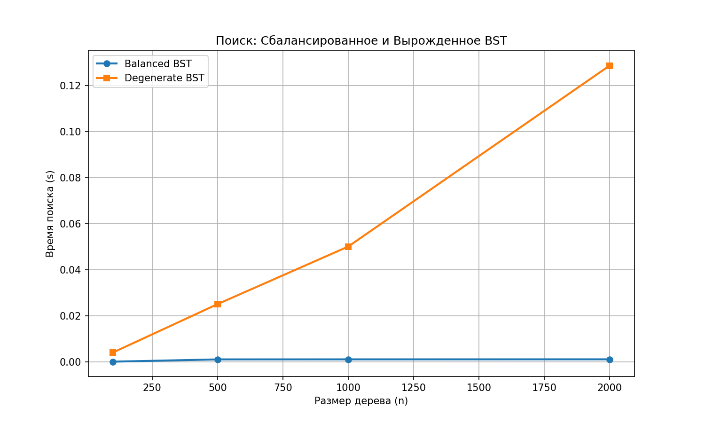

# Отчет по лабораторной работе 6
# Деревья. Бинарные деревья поиска

**Дата:** 2025-12-12  
**Семестр:** 3 курс 1 полугодие - 5 семестр  
**Группа:** ПИЖ-б-о-23-2(1)  
**Дисциплина:** Анализ сложности алгоритмов  
**Студент:** Хатуаева Дайана Тныбековна

## Цель работы
Изучить древовидные структуры данных, их свойства и применение. Освоить основные операции с бинарными деревьями поиска (BST). Получить практические навыки реализации BST на основе узлов (pointer-based), рекурсивных алгоритмов обхода и анализа их эффективности. Исследовать влияние сбалансированности дерева на производительность операций.

## Теоретическая часть
- Дерево: Рекурсивная структура данных, состоящая из узлов, где каждый узел имеет значение и ссылки на дочерние узлы.
- Бинарное дерево поиска (BST): Дерево, для которого выполняются следующие условия:  
  - Значение в левом поддереве любого узла меньше значения в самом узле.   
  - Значение в правом поддереве любого узла больше значения в самом узле.
  - Оба поддерева являются бинарными деревьями поиска.
- Основные операции BST:
  - Вставка (Insert): Сложность: в среднем O(log n), в худшем (вырожденное дерево) O(n).
  - Поиск (Search): Сложность: в среднем O(log n), в худшем (n).
  - Удаление (Delete): Сложность: в среднем O(log n), в худшем O(n). Имеет три случая: удаление листа, узла с одним потомком, узла с двумя потомками.
  - Обход (Traversal):
    - In-order (левый-корень-правый): Посещает узлы в порядке возрастания. Сложность O(n).
    - Pre-order (корень-левый-правый): Полезен для копирования структуры дерева. Сложность O(n).
    - Post-order (левый-правый-корень): Полезен для удаления дерева. Сложность O(n).
- Сбалансированные деревья: Деревья с контролем высоты (например, AVL, Красно-черные), которые гарантируют время операций O(log n) даже в худшем случае

## Практическая часть

### Выполненные задачи
- [x] Задача 1: Реализовать бинарное дерево поиска на основе узлов с основными операциями.
- [x] Задача 2: Реализовать различные методы обхода дерева (рекурсивные и итеративные).
- [x] Задача 3: Реализовать дополнительные методы для работы с BST.
- [x] Задача 4: Провести анализ сложности операций для сбалансированного и вырожденного деревьев.
- [x] Задача 5: Визуализировать структуру дерева.

### Ключевые фрагменты кода

####  Реализация BST (в binary_search_tree.py):
Класс TreeNode:

```python
class TreeNode:
    """Node class для бинарного дерева поиска"""
    def __init__(self, value):  # Конструктор узла. O(1)
        self.value = value  # Значение узла
        self.left = None  # Левое поддерево
        self.right = None  # Правое поддерево
        self.height = 1  # Высота узла

```

Класс BinarySearchTree с методами:
- insert(value)
- search(value)
- delete(value)
- find_min(node) (поиск минимума в поддереве)
- find_max(node) (поиск максимума в поддереве)
- is_valid()
- height(node)

```python
class TreeNode:
    """Node class для бинарного дерева поиска"""
    def __init__(self, value):  # Конструктор узла. O(1)
        self.value = value  # Значение узла
        self.left = None  # Левое поддерево
        self.right = None  # Правое поддерево
        self.height = 1  # Высота узла


class BinarySearchTree:
    """Бинарное дерево поиска.
    Сложность: средняя O(log n), худшая O(n)"""

    def __init__(self):  # Инициализация пустого дерева. O(1)
        self.root = None  # Корневой узел
        self.operation_count = 0  # Счетчик операций

    def insert(self, value):
        """Вставка.
        Сложность: средняя O(log n), худшая O(n)"""
        if self.root is None:  # Если дерево пусто
            self.root = TreeNode(value)  # Создаём корень
            return
        self._insert_recursive(self.root, value)

    def _insert_recursive(self, node, value):
        """Рекурсивная вставка.
        Сложность: средняя O(log n), худшая O(n)"""
        self.operation_count += 1  # Увеличиваем счётчик операций
        if value < node.value:
            if node.left is None:  # Если левого поддерева нет
                node.left = TreeNode(value)
            else:
                self._insert_recursive(node.left, value)
        elif value > node.value:  # Если значение больше текущего узла
            if node.right is None:
                node.right = TreeNode(value)  # Создём правый узел
            else:
                self._insert_recursive(node.right, value)
        self._update_height(node)

    def search(self, value):
        return self._search_recursive(self.root, value)

    def _search_recursive(self, node, value):
        """Рекурсивный поиск.
        Сложность: O(log n), O(n) худшая"""
        self.operation_count += 1
        if node is None:
            return None
        if value == node.value:
            return node.value
        if value < node.value:
            return self._search_recursive(node.left, value)  # Ищем слева
        return self._search_recursive(node.right, value)  # Ищем справа

    def delete(self, value):
        """Удаление. Средняя O(log n), худшая O(n)"""
        self.root = self._delete_recursive(self.root, value)

    def _delete_recursive(self, node, value):
        """Рекурсивное удаление. O(log n) средняя, O(n) худшая"""
        self.operation_count += 1
        if node is None:
            return None
        if value < node.value:  # Если значение меньше
            node.left = self._delete_recursive(node.left, value)  # Рекурсивно удаляем слева
        elif value > node.value:  # Если значение больше
            node.right = self._delete_recursive(node.right, value)  # Рекурсивно удаляем справа
        else:  # Если найден узел для удаления
            if node.left is None:  # Если левого потомка нет
                return node.right
            if node.right is None:  # Если правого потомка нет
                return node.left
            min_value = self._find_min_recursive(node.right)  # Находим минимум в правом поддереве
            node.value = min_value
            node.right = self._delete_recursive(node.right, min_value)
        if node:
            self._update_height(node)
        return node

    def find_min(self, node=None):
        """Поиск минимума.
        O(log n) средняя, O(n) худшая"""
        if self.root is None:
            return None
        return self._find_min_recursive(self.root)

    def _find_min_recursive(self, node):
        """Рекурсивный поиск минимума.
        O(log n) средняя, O(n) худшая"""
        self.operation_count += 1
        if node.left is None:  # Если левого потомка нет
            return node.value
        return self._find_min_recursive(node.left)

    def find_max(self):
        """Поиск максимума.
        O(log n) средняя, O(n) худшая"""
        if self.root is None:
            return None
        return self._find_max_recursive(self.root)

    def _find_max_recursive(self, node):
        """Рекурсивный поиск максимума.
        O(log n) средняя, O(n) худшая"""
        self.operation_count += 1
        if node.right is None:  # Если правого потомка нет
            return node.value  # Возвращаем значение узла
        return self._find_max_recursive(node.right)

    def is_valid(self):
        """Проверка корректности BST. O(n)"""
        def _check(node, min, max):  # Проверка с границами, O(n)
            if node is None:
                return True
            if node.value <= min or node.value >= max:  # Если значение вне границ
                return False
            return _check(node.left, min, node.value) and _check(node.right, node.value, max)
        return _check(self.root, float('-inf'), float('inf'))

    def height(self):
        """Получение высоты дерева. O(1)"""
        if self.root is None:
            return 0
        return self.root.height

    def _update_height(self, node):
        """Обновление высоты узла. O(1)"""
        if node is None:
            return
        left_height = node.left.height if node.left else 0
        right_height = node.right.height if node.right else 0
        node.height = 1 + max(left_height, right_height)
```

#### Реализация обходов (в tree_traversal.py)
Реализовать рекурсивные версии обходов (in-order, pre-order, post-order) для печати элементов.  
Реализовать итеративную версию in-order обхода с использованием стека.

```python
def inorder_recursive(bst):
    """In-order рекурсивный обход (левый-корень-правый). O(n)"""
    res = []

    def _traverse(node):
        if node is None:
            return
        _traverse(node.left)  # Обход левого поддерева
        res.append(node.value)
        _traverse(node.right)  # Обход правого поддерева
    _traverse(bst.root)  # Начинаем обход с корня
    return res


def preorder_recursive(bst):
    """Pre-order рекурсивный обход (корень-левый-правый). O(n)"""
    res = []

    def _traverse(node):  # Рекурсивный обход. O(n)
        if node is None:
            return
        res.append(node.value)
        _traverse(node.left)  # Обход левого поддерева
        _traverse(node.right)  # Обход правого поддерева
    _traverse(bst.root)  # Начинаем обход с корня
    return res


def postorder_recursive(bst):
    """Post-order рекурсивный обход (левый-правый-корень). O(n)"""
    res = []

    def _traverse(node):  # Рекурсивный обход. O(n)
        if node is None:
            return
        _traverse(node.left)  # Обход левого поддерева
        _traverse(node.right)  # Обход правого поддерева
        res.append(node.value)
    _traverse(bst.root)  # Начинаем обход с корня
    return res


def inorder_iterative(bst):
    """In-order итеративный обход (левый-корень-правый). O(n)"""
    res = []
    stack = []  # Стек для обхода
    current = bst.root
    while current or stack:
        while current:
            stack.append(current)
            current = current.left  # Переходим влево
        current = stack.pop()  # Извлекаем узел из стека
        res.append(current.value)
        current = current.right  # Переходим вправо
    return res
```

#### Пример вывода работы обходов:

```
In-order (рекурсивный): [2, 3, 4, 5, 6, 7, 8]
Pre-order (рекурсивный): [5, 3, 2, 4, 7, 6, 8] 
Post-order (рекурсивный): [2, 4, 3, 6, 8, 7, 5]
In-order (итеративный): [2, 3, 4, 5, 6, 7, 8] 
```

#### Тестирование и визуализация

```python
import sys
import time
import random
import matplotlib.pyplot as plt
import unittest
from binary_search_tree import BinarySearchTree
from tree_traversal import inorder_recursive, inorder_iterative

sys.setrecursionlimit(10000)  # Добавьте эту строку в начале файла


class TestBST(unittest.TestCase):

    def test_ins_srch(self):
        """Тест вставки и поиска"""
        bst = BinarySearchTree()
        bst.insert(5)
        bst.insert(3)
        bst.insert(7)
        self.assertEqual(bst.search(3), 3)
        self.assertEqual(bst.search(7), 7)
        self.assertIsNone(bst.search(10))

    def test_delete(self):
        """Тест удаления"""
        bst = BinarySearchTree()
        for v in [5, 3, 7, 1, 4]:
            bst.insert(v)
        bst.delete(3)
        self.assertIsNone(bst.search(3))

    def test_find_min_max(self):
        """Тест поиска минимума и максимума"""
        bst = BinarySearchTree()
        for v in [5, 3, 7, 1, 9]:
            bst.insert(v)
        self.assertEqual(bst.find_min(), 1)
        self.assertEqual(bst.find_max(), 9)

    def test_is_valid(self):
        """Тест проверки корректности BinarySearchTree"""
        bst = BinarySearchTree()
        for v in [5, 3, 7]:
            bst.insert(v)
        self.assertTrue(bst.is_valid())

    def test_inord(self):
        """Тест in-order обхода"""
        bst = BinarySearchTree()
        for v in [5, 3, 7, 1, 4]:
            bst.insert(v)
        res = inorder_recursive(bst)
        self.assertEqual(res, [1, 3, 4, 5, 7])

    def test_height(self):
        """Тест вычисления высоты"""
        bst = BinarySearchTree()
        bst.insert(5)
        bst.insert(3)
        bst.insert(7)
        self.assertEqual(bst.height(), 2)

    def test_inord_iter(self):
        """Тест итеративного in-order обхода"""
        bst = BinarySearchTree()
        for v in [5, 3, 7, 1, 4]:
            bst.insert(v)
        res = inorder_iterative(bst)
        self.assertEqual(res, [1, 3, 4, 5, 7])


def perf_test():
    """Анализ производительности. O(n*m) где n - размер, m - операции"""
    sizes = [100, 500, 1000, 2000]
    operations_per_size = 1000
    balanced_times = []  # Времена для сбалансированного дерева
    degenerate_times = []  # Времена для вырожденного дерева

    for size in sizes:
        balanced_bst = BinarySearchTree()
        degenerate_bst = BinarySearchTree()
        values = list(range(1, size + 1))
        random.shuffle(values)  # Перемешиваем для сбалансированного
        for v in values:
            balanced_bst.insert(v)  # Вставляем значение
        for v in range(1, size + 1):
            degenerate_bst.insert(v)
        search_values = [random.randint(1, size) for _ in range(operations_per_size)]
        balanced_bst.operation_count = 0
        t0 = time.time()
        for v in search_values:
            balanced_bst.search(v)
        balanced_time = time.time() - t0  # Время поиска в сбалансированном

        degenerate_bst.operation_count = 0
        t0 = time.time()
        for v in search_values:
            degenerate_bst.search(v)
        degenerate_time = time.time() - t0  # Время поиска в вырожденном

        balanced_times.append(balanced_time)
        degenerate_times .append(degenerate_time)

    fig, ax = plt.subplots(figsize=(10, 6))
    ax.plot(sizes, balanced_times, marker='o', label='Balanced BST', linewidth=2)
    ax.plot(sizes, degenerate_times, marker='s', label='Degenerate BST', linewidth=2)
    ax.set_xlabel('Размер дерева (n)')
    ax.set_ylabel('Время поиска (s)')
    ax.set_title('Поиск: Сбалансированное и Вырожденное BST')
    ax.legend()
    ax.grid(True)
    plt.savefig('perf_bst.png', dpi=150)
    plt.close()


# Характеристики ПК
pc_info = """
Характеристики ПК для тестирования:
- Процессор: 12th Gen Intel(R) Core(TM) i5-12450H
- Оперативная память: 16 GB DDR4
- ОС: Windows 10
- Python: 3.12.10
"""
print(pc_info)


def run_all():
    suite = unittest.TestLoader().loadTestsFromTestCase(TestBST)
    runner = unittest.TextTestRunner(verbosity=1)
    result = runner.run(suite)
    if result.wasSuccessful():
        perf_test()  # Анализ производительности


if __name__ == "__main__":
    run_all()
```

#### Результаты тестирования следующие:
```
Характеристики ПК для тестирования:
- Процессор: 12th Gen Intel(R) Core(TM) i5-12450H
- Оперативная память: 16 GB DDR4
- ОС: Windows 10
- Python: 3.12.10

.......
----------------------------------------------------------------------
Ran 7 tests in 0.001s

OK
```

#### tree_traversal.py:
```
In-order (рекурсивный): [2, 3, 4, 5, 6, 7, 8]
Pre-order (рекурсивный): [5, 3, 2, 4, 7, 6, 8]
Post-order (рекурсивный): [2, 4, 3, 6, 8, 7, 5]
In-order (итеративный): [2, 3, 4, 5, 6, 7, 8]
```


#### График  зависимости времени операций от количества элементов
для сбалансированного и вырожденного случаев




### Временная сложность операций

|   Операция    | Лучший случай | Средний случай | Худший случай |
|---------------|---------------|----------------|---------------|
|   insert      | O(log n)      | O(log n)       | O(n)          |
|   search      | O(log n)      | O(log n)       | O(n)          |
|   delete      | O(log n)      | O(log n)       | O(n)          |
| Find Min/Max  | O(n)          | O(log n)       | O(n)          |
|  traversal    | O(n)          | O(n)           | O(n)          |
|  height       | O(1)          | O(1)           | O(1)          |
|  is_valid     | O(n)          | O(n)           | O(n)          |


## Ответы на контрольные вопросы
1. Сформулируйте основное свойство бинарного дерева поиска (BST).

Бинарное дерево поиска обладает следующим свойством: 
если x — узел бинарного дерева с ключом k, то все узлы в левом поддереве должны иметь ключи, меньшие k, а в правом поддереве большие k.

2. Опишите алгоритм вставки нового элемента в BST. Какова сложность этой операции в сбалансированном и вырожденном дереве?

Алгоритм вставки нового элемента следующий:
- Сначала проверяется, пусто ли дерево: если да, создаём корневой узел.
- Далее новое значение сравнивается с текущим узлом (начиная с корня).
  - Если значение меньше текущего узла переходим к левому поддереву.
  - Если значение больше текущего узла переходим к правому поддереву.
- Когда достигаем None места, создаём новый узел.
- Затем обновляем высоту всех пройденных узлов.

Сложность для сбалансированного дерева: O(log n), так как на каждом уровне отбрасывается половина элементов

Сложность для вырожденного дерева: O(n); дерево превращается в связный список.

3. Чем отличается обход дерева в глубину (DFS) от обхода в ширину (BFS)? Назовите виды DFS обходов и их особенности.

Обход в глубину (Depth First Search, DFS) выполняется следующим образом:

Начинается с вершины и углубляется настолько глубоко, насколько возможно, перед переходом к следующей вершине.
Использует стек для хранения промежуточных состояний.
Может выполняться рекурсивно или итеративно с использованием стека.
Виды DFS-обходов:
- In-order (симметричный порядок): Левое поддерево-корень-правое поддерево.
- Pre-order (префиксный порядок): Корень-левое поддерево-правое поддерево.
- Post-order (постфиксный порядок): Левое поддерево-правое поддерево-корень.

DFS используется для решения проблем поиска путей, циклов.
Как правило, он быстрее BFS при поиске коротких путей в глубоких ветвях графа.

Обход в ширину (Breadth First Search, BFS) работает следующим образом:

Начинается с вершины и посещает соседние вершины на одном уровне перед переходом на следующий уровень.
Использует очередь для хранения промежуточных состояний.  
BFS чаще всего применяется для поиска кратчайших путей в неориентированных и невзвешенных графах.
Требует больше памяти, чем DFS.

4. Почему в вырожденном BST (например, когда элементы добавляются в отсортированном порядке) сложность операций поиска и вставки становится O(n)?

Это происходит потому, что когда элементы добавляются в отсортированном порядке, дерево превращается в связный список.
При поиске отбрасывается только 1 элемент (текущий узел).
Каждая новая вставка добавляет элемент либо слева (для убывающего порядка), либо справа (для возрастающего порядка).
Таким образом, каждая последующая операция поиска или вставки требует прохождения всех предыдущих узлов, что приводит к линейной сложности O(n).

5. Что такое сбалансированное дерево (например, AVL-дерево) и как оно решает проблему вырождения BST?

Сбалансированное дерево — это структура данных, в которой высота левого и правого поддеревьев каждого узла отличается не более чем на единицу. Это позволяет сохранять логарифмическую сложность поиска (O(log n)), что делает его эффективным для операций поиска, вставки и удаления.
Благодаря автоматическому поддержанию баланса, такие деревья предотвращают деградацию до линейного случая и обеспечивают стабильную производительность операций поиска, вставки и удаления.