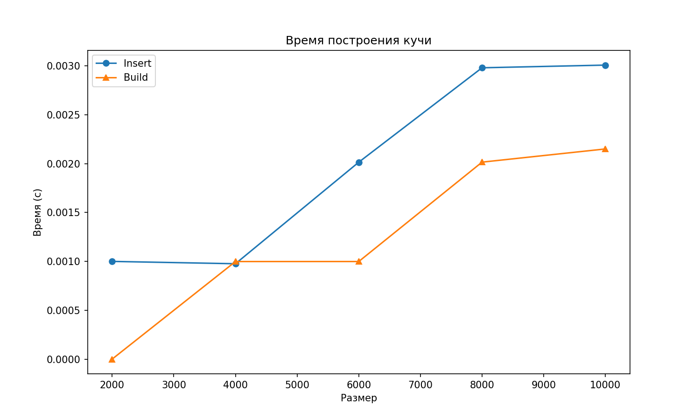
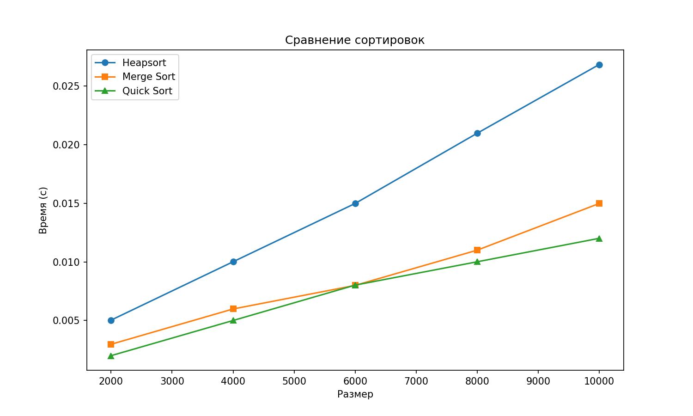

# Отчет по лабораторной работе 7
# Кучи (Heaps)

**Дата:** 2025-12-12  
**Семестр:** 3 курс 1 полугодие - 5 семестр  
**Группа:** ПИЖ-б-о-23-2(1)  
**Дисциплина:** Анализ сложности алгоритмов  
**Студент:** Хатуаева Дайана Тныбековна

## Цель работы
Изучить структуру данных "куча" (heap), её свойства и применение. Освоить основные операции с кучей (добавление, извлечение корня) и алгоритм её построения. Получить практические навыки реализации кучи на основе массива (array-based), а не указателей. Исследовать эффективность основных операций и применение кучи для сортировки и реализации приоритетной очереди.

## Теоретическая часть
- Куча (Heap)  
Специализированная древовидная структура данных, удовлетворяющая свойству
кучи. Является полным бинарным деревом (все уровни заполнены, кроме последнего, который заполняется слева направо).
- Свойство кучи:
  - Min-Heap: Значение в любом узле меньше или равно значениям его потомков. Корень — минимальный элемент.
  - Max-Heap: Значение в любом узле больше или равно значениям его потомков. Корень — максимальный элемент.
- Реализация: Куча эффективно реализуется на основе массива. Для узла с индексом i:
  - Индекс родителя: (i-1)//2
  - Индекс левого потомка: 2*i + 1
  - Индекс правого потомка: 2*i + 2
- Основные операции:
  - Вставка (Insert): Элемент добавляется в конец массива и "всплывает" (sift-up) до восстановления свойства кучи. Сложность: O(log n).
  - Извлечение корня (Extract): Корень (элемент [0]) извлекается, последний элемент ставится на его место и "погружается" (sift-down) до восстановления свойства кучи.
Сложность: O(log n).
- Построение кучи (Heapify): Преобразование произвольного массива в кучу. Может быть
выполнено алгоритмом со сложностью O(n)
- Применение:
  - Сортировка кучей (Heapsort).
  - Реализация приоритетной очереди.
  - Алгоритм Дейкстры.

## Практическая часть

### Выполненные задачи
- [x] Задача 1: Реализовать структуру данных "куча" (min-heap и max-heap) на основе массива.
- [x] Задача 2: Реализовать основные операции и алгоритм построения кучи из массива.
- [x] Задача 3: Реализовать алгоритм сортировки кучей (Heapsort).
- [x] Задача 4: Провести анализ сложности операций.
- [x] Задача 5: Сравнить производительность сортировки кучей с другими алгоритмами.

### Ключевые фрагменты кода

#### Реализация кучи в heap.py
Ниже представлен класс Heap, с реализованными внутренними методами:
- _sift_up(index): Всплытие элемента.
- _sift_down(index): Погружение элемента.
и основными методами:
- insert(value): Вставка элемента.
- extract(): Извлечение корня.
- peek(): Просмотр корня.
- build_heap(array).

```python
class Heap:
    """Реализация бинарной кучи (min-heap/max-heap).

    Поддерживает основные операции с кучей: вставка, извлечение корня,
    просмотр корня и построение кучи из массива.

    Сложность: O(1) для корня
    """
    def __init__(self, is_min=True):
        self.heap = []  # Массив элементов кучи
        self.is_min = is_min

    def _compare(self, x, y):
        """"Сравнивает два элемента в соответствии с типом кучи."""
        return x < y if self.is_min else x > y  # Для min-heap: <, для max-heap: >

    def insert(self, value):
        """Добавляет элемент в кучу.

        Сложность: O(log n).

        Аргумент:
            value: Элемент для вставки.
        """
        self.heap.append(value)  # Добавляем в конец
        self._sift_up(len(self.heap) - 1)  # Поднимаем вверх

    def extract(self):
        """Извлекает корневой элемент (минимальный или максимальный).

        Сложность: O(log n).
        """
        if not self.heap:
            return None
        res = self.heap[0]  # Корень (min или max в зависимости от типа)
        last = self.heap.pop()  # Последний элемент
        if self.heap:
            self.heap[0] = last  # Переносим в корень
            self._sift_down(0)  # Погружаем вниз
        return res

    def peek(self):
        """Просмотр корня.

        Сложность: O(1).
        """
        return self.heap[0] if self.heap else None

    def _sift_up(self, index):
        """Поднимает элемент на корректную позицию (всплытие).

        Аргументы:
            index: Индекс элемента для подъёма.
        """
        while index > 0:
            parent_index = (index - 1) // 2
            if not self._compare(self.heap[index], self.heap[parent_index]):
                break
            self.heap[index], self.heap[parent_index] = self.heap[parent_index], self.heap[index]
            index = parent_index

    def _sift_down(self, index):
        """Опускает элемент на корректную позицию (погружение).

        Сложность: O(log n)

        Аргументы:
            index: Индекс элемента для опускания.
        """
        size = len(self.heap)
        while True:
            left = 2 * index + 1
            right = 2 * index + 2
            idx = index
            if left < size and self._compare(self.heap[left], self.heap[idx]):
                idx = left
            if right < size and self._compare(self.heap[right], self.heap[idx]):
                idx = right
            if idx == index:
                break
            self.heap[index], self.heap[idx] = self.heap[idx], self.heap[index]
            index = idx

    def build_heap(self, array):
        """Строит кучу из произвольного массива.

        Сложность: O(n).

        Аргументы:
            array: Массив элементов.
        """
        self.heap = array[:]
        for i in range((len(self.heap) - 2)//2, -1, -1):
            self._sift_down(i)

    def is_heap(self):
        """Проверка свойства кучи, O(n)."""
        size = len(self.heap)
        for i in range(size // 2):
            left = 2 * i + 1
            right = 2 * i + 2
            ok_l = (left >= size) or not self._compare(self.heap[left], self.heap[i])
            ok_r = (right >= size) or not self._compare(self.heap[right], self.heap[i])
            if not (ok_l and ok_r):
                return False
        return True

    def show(self):
        """Визуализация кучи (текстовая).
        Сложность: O(n)."""
        def _display_node(index, pref):
            if index < len(self.heap):
                print(pref + str(self.heap[index]))
                left = 2 * index + 1
                right = 2 * index + 2
                if left < len(self.heap): _display_node(left, pref + "  ")
                if right < len(self.heap): _display_node(right, pref + "  ")
        if self.heap:
            _display_node(0, "")
```

#### Реализация Heapsort (в heapsort.py)
Функция heapsort(array), использующая кучу для сортировки.
in-place версия Heapsort, которая не использует дополнительную память подкучу, а преобразует исходный массив.

```python
# heapsort.py
from heap import Heap


def heapsort(array, is_min=True):
    """Сортирует массив с использованием кучи.

    Сложность: O(n log n).

    Аргументы:
        arr: Массив для сортировки.
        is_min: Если True, сортировка по возрастанию, иначе по убыванию.

    Возвращает:
        Отсортированный массив.
    """
    heap = Heap(is_min)
    heap.build_heap(array)  # O(n)
    out = []
    for _ in range(len(array)):
        out.append(heap.extract())  # O(log n) на каждый
    return out if is_min else list(reversed(out))


def heapsort_inplace(array):
    """In-place сортировка кучей.

    Сложность: O(n log n).
    Изменяет исходный массив.

    Аргументы:
        arr: Массив для сортировки.
    """
    size = len(array)
    # Строим max-heap
    for i in range(size // 2 - 1, -1, -1):
        _sift_down_arr(array, i, size)
    # Извлекаем элементы
    for i in range(size - 1, 0, -1):
        array[0], array[i] = array[i], array[0]
        _sift_down_arr(array, 0, i)


def _sift_down_arr(array, i, size):
    """Опускает элемент в max-heap для inplace сортировки.

    Аргументы:
        array: Массив, представляющий кучу.
        i: Индекс элемента для опускания.
        size: Текущий размер кучи.
    """
    while True:
        left, right = 2 * i + 1, 2 * i + 2
        idx = i
        if left < size and array[left] > array[idx]:
            idx = left
        if right < size and array[right] > array[idx]:
            idx = right
        if idx == i:
            break
        array[i], array[idx] = array[idx], array[i]
        i = idx
```

#### Реализация приоритетной очереди (в priority_queue.py)
На основе кучи реализован класс PriorityQueue с методами enqueue(item, priority) и
dequeue().

```python
# priority_queue.py
from heap import Heap


class PriorityQueue:
    """Приоритетная очередь на куче
    Сложность: O(log n)"""
    def __init__(self):
        self.heap = Heap(is_min=True)

    def enqueue(self, item, priority):
        """Добавляет элемент в очередь с приоритетом.
        CСложность: O(log n)."""
        self.heap.insert((priority, item))

    def dequeue(self):
        """Извлекает элемент с наивысшим приоритетом.
        Сложность: O(log n)."""
        priority, item = self.heap.extract()
        return item

    def peek(self):
        """Возвращает элемент с наивысшим приоритетом без извлечения.
        Сложность:  # O(1)."""
        return self.heap.peek()[1] if self.heap.peek() else None
```

#### Быстрая сортировка и сортировка слиянием

```python
# sorts.py
from typing import List


def merge_sort(arr: List[int]) -> List[int]:
    """
    Сортировка слиянием.

    Временная сложность:
    - Худший случай: O(n log n)
    - Средний случай: O(n log n)
    - Лучший случай: O(n log n)

    Пространственная сложность:
    - O(n) - требуется дополнительная память для временных массивов
    """
    if len(arr) <= 1:
        return arr.copy()

    # Рекурсивно делим массив на две части
    mid = len(arr) // 2
    left = merge_sort(arr[:mid])
    right = merge_sort(arr[mid:])

    # Сливаем отсортированные части
    return _merge(left, right)


def _merge(left: List[int], right: List[int]) -> List[int]:
    """Вспомогательная функция для слияния двух отсортированных массивов"""
    result = []
    i = j = 0

    # Сливаем, пока есть элементы в обоих массивах
    while i < len(left) and j < len(right):
        if left[i] <= right[j]:
            result.append(left[i])
            i += 1
        else:
            result.append(right[j])
            j += 1

    # Добавляем оставшиеся элементы
    result.extend(left[i:])
    result.extend(right[j:])

    return result


def quick_sort(arr: List[int]) -> List[int]:
    """
    Быстрая сортировка.

    Временная сложность:
    - Худший случай: O(n²)
    - Средний случай: O(n log n)
    - Лучший случай: O(n log n) - хороший выбор опорного элемента

    Пространственная сложность:
    - O(log n) - глубина рекурсии (в среднем случае)
    - O(n) - в худшем случае (несбалансированные разбиения)
    """
    if len(arr) <= 1:
        return arr.copy()

    # Выбираем опорный элемент
    first, middle, last = arr[0], arr[len(arr) // 2], arr[-1]
    pivot = sorted([first, middle, last])[1]

    # Разделяем массив на элементы меньше, равные и больше опорного
    less = [x for x in arr if x < pivot]
    equal = [x for x in arr if x == pivot]
    greater = [x for x in arr if x > pivot]

    # Рекурсивно сортируем подмассивы и объединяем результаты
    return quick_sort(less) + equal + quick_sort(greater)
```

#### Экспериментальное исследование и визуализация

```python
# performance_analysis.py
import time
import random
import matplotlib.pyplot as plt
from heap import Heap
from heapsort import heapsort, heapsort_inplace
from priority_queue import PriorityQueue
from sorts import merge_sort, quick_sort


def perf_test():
    """Замеры времени: построение кучи, сортировка."""
    ns = [2000, 4000, 6000, 8000, 10000]
    times_seq = []
    times_build = []
    hs_times = []
    ms_times = []
    qs_times = []

    for n in ns:
        arr = [random.randint(1, 100000) for _ in range(n)]

        # Замер времени последовательной вставки
        t0 = time.time()
        heap = Heap(is_min=True)
        for x in arr:
            heap.insert(x)
        t1 = time.time()
        times_seq.append(t1 - t0)

        # Замер времени быстрого построения кучи
        t0 = time.time()
        h2 = Heap(is_min=True)
        h2.build_heap(arr)
        t1 = time.time()
        times_build.append(t1 - t0)

        # Замер времени вашей реализации Heapsort
        t0 = time.time()
        heapsort(arr)
        t1 = time.time()
        hs_times.append(t1 - t0)

        # Замер времени вашей реализации Mergesort
        t0 = time.time()
        merge_sort(arr)
        t1 = time.time()
        ms_times.append(t1 - t0)

        # Замер времени вашей реализации Quicksorth
        t0 = time.time()
        quick_sort(arr)
        t1 = time.time()
        qs_times.append(t1 - t0)

    # График времени построения кучи
    fig, ax = plt.subplots(figsize=(10, 6))
    ax.plot(ns, times_seq, marker='o', label='Sequential Insert')
    ax.plot(ns, times_build, marker='^', label='Build Heap')
    ax.set_title('Heap Building Time')
    ax.set_xlabel('Array Size')
    ax.set_ylabel('Time (s)')
    ax.legend()
    plt.savefig('heap_build.png', dpi=150)
    plt.close()

    # График времени сортировки
    fig, ax = plt.subplots(figsize=(10, 6))
    ax.plot(ns, hs_times, marker='o', label='Heapsort')
    ax.plot(ns, ms_times, marker='s', label='Merge Sort')
    ax.plot(ns, qs_times, marker='^', label='Quick Sort')
    ax.set_title('Sorting Performance')
    ax.set_xlabel('Array Size')
    ax.set_ylabel('Time (s)')
    ax.legend()
    plt.savefig('sort_perf.png', dpi=150)
    plt.close()


def demo():
    arr = [12, 7, 8, 3, 5, 1, 18]
    heap = Heap(is_min=True)
    for x in arr:
        heap.insert(x)
    heap.show()
    arr2 = [5, 1, 7, 3, 2]
    print(heapsort(arr2))
    arr3 = [5, 2, 8, 3, 10, 1]
    heapsort_inplace(arr3)
    print(arr3)
    pq = PriorityQueue()
    pq.enqueue("task1", 3)
    pq.enqueue("task2", 1)
    pq.enqueue("task3", 2)
    print([pq.dequeue() for _ in range(3)])  # "task2", "task3", "task1"


if __name__ == "__main__":
    perf_test()  # Запускаем замер производительности
    demo()
```

#### Unit-тесты для проверки корректности работы кучи

```python
# tests.py
import unittest
from heap import Heap
from heapsort import heapsort, heapsort_inplace
from priority_queue import PriorityQueue


class TestHeap(unittest.TestCase):
    def test_heap_ops(self):
        """Вставка, извлечение: min-heap."""
        heap = Heap(is_min=True)
        data = [5, 2, 8, 3, 10, 1]
        for x in data:
            heap.insert(x)
        self.assertEqual(heap.extract(), 1)
        self.assertEqual(heap.extract(), 2)
        self.assertTrue(heap.is_heap())

    def test_heap_build(self):
        """ Построение кучи из массива."""
        heap = Heap(is_min=False)
        array = [1, 5, 3, 8, 4]
        heap.build_heap(array)
        self.assertTrue(heap.is_heap())

    def test_heapsort(self):
        """Проверка Heapsort."""
        array = [5, 1, 7, 3, 2]
        res = heapsort(array)
        self.assertEqual(res, sorted(array))

    def test_heapsort_inplace(self):
        """In-place Heapsort."""
        array = [5, 12, 1, 7, 3, 2]
        arr = array[:]
        heapsort_inplace(arr)
        self.assertEqual(arr, sorted(array))

    def test_priority_queue(self):
        """Приоритетная очередь."""
        pq = PriorityQueue()
        pq.enqueue("low", 3)
        pq.enqueue("high", 1)
        pq.enqueue("medium", 2)
        self.assertEqual(pq.dequeue(), "high")  # min priority first
        self.assertEqual(pq.dequeue(), "medium")
        self.assertEqual(pq.dequeue(), "low")


if __name__ == '__main__':
    unittest.TextTestRunner(verbosity=1).run(unittest.TestLoader().loadTestsFromTestCase(TestHeap))
```

## Результаты выполнения

#### Тесты:
```
test_heap_build (__main__.TestHeap.test_heap_build)
Построение кучи из массива. ... ok
test_heap_ops (__main__.TestHeap.test_heap_ops)
test_heapsort (__main__.TestHeap.test_heapsort)
Проверка Heapsort. ... ok
test_heapsort_inplace (__main__.TestHeap.test_heapsort_inplace)
In-place Heapsort. ... ok
test_priority_queue (__main__.TestHeap.test_priority_queue)
Приоритетная очередь. ... ok

----------------------------------------------------------------------
Ran 5 tests in 0.001s

OK
```

#### performance_analysis.py:
```
Характеристики ПК для тестирования:
    - Процессор: 12th Gen Intel(R) Core(TM) i5-12450H
    - Оперативная память: 16 GB DDR4
    - ОС: Windows 10
    - Python: 3.12.10

1
  5
    12
    7
  3
    8
    18
[1, 2, 3, 5, 7]
[1, 2, 3, 5, 8, 10]
['task2', 'task3', 'task1']
```
### Графики






## Ответы на контрольные вопросы
1. Сформулируйте основное свойство min-кучи и max-кучи.

Основное свойство min-кучи (Min-Heap) и max-кучи (Max-Heap) заключается в том, что родительский элемент всегда меньше или больше своих дочерних элементов. Это свойство связано с порядком элементов в куче — извлечение происходит в соответствии с приоритетом: если первыми извлекаются элементы с меньшим значением ключа, говорят о min-куче, если с большим — о max-куче.

2. Опишите алгоритм операции вставки нового элемента в кучу (процедуру sift_up).

Алгоритм sift_up (всплытие):
- Добавление элемента: новый элемент добавляется в конец массива (становится последним листом дерева).
- Восстановление свойства кучи:
  - Сравниваем добавленный элемент с его родителем.
  - Если нарушено свойство кучи (для min-heap: элемент меньше родителя; для max-heap: элемент больше родителя).
  - Меняем элементы местами.
- Повторение: Повторяем шаг 2, поднимаясь вверх по дереву, пока:
  - Не достигнем корня.
  - Или свойство кучи не будет восстановлено.

3. Какова временная сложность построения кучи из произвольного массива и почему она равна O(n), а не O(n log n)?

O(n) — временная сложность построения кучи (полного двоичного дерева, в котором каждый родительский узел больше (или меньше, в случае минимальной кучи) своих дочерних узлов) из произвольного массива. 
Это следует из того, что для построения кучи используется процедура всплытия, которая позволяет перемещать элементы так, чтобы соблюдалось свойство кучи.

4. Опишите, как работает алгоритм пирамидальной сортировки (Heapsort).

Алгоритм работает следующим образом:
- Построение кучи (O(n))  
Исходный массив преобразуется в max-heap.  
Используется алгоритм heapify, начиная с последнего нелистового элемента.  
- Сортировка (O(n log n)).  
Извлечение максимума: меняем местами корень (максимум) с последним элементом.  
Уменьшаем размер кучи на 1.  
Вызываем sift_down для нового корня.
Затем повторяем шаг 1 для оставшейся части массива.

5. Почему кучу часто используют для реализации приоритетной очереди? Какие операции приоритетной очереди она эффективно поддерживает?

Приоритетная очередь — это структура данных, предназначенная для хранения набора объектов, каждому из которых присвоен определённый приоритет. Основное назначение приоритетной очереди заключается в возможности эффективно извлекать объект с наибольшим (или наименьшим) приоритетом.

Использование кучи для реализации приоритетных очередей связано с её эффективной поддержкой ключевых операций, характерных для приоритетных очередей:

- Insert (добавление нового элемента), время выполнения: O(logN).


Куча гарантирует, что операция добавления выполняется эффективно благодаря механизму всплытия.

- Extract Max / Extract Min (извлечение максимального или минимального элемента), время выполнения: O(logN).

Так как максимум (для max-кучи) или минимум (для min-кучи) всегда находится в корне, операция извлечения сводится к удалению корня и восстановлению порядка в куче посредством механизма погружения.

- Peek (просмотр вершины без удаления), время выполнения: O(1).

Вершина (корень) доступна сразу, поэтому доступ осуществляется мгновенно.
Эти три ключевые операции выполняются эффективно и обеспечивают хорошую производительность даже при больших объёмах данных.
