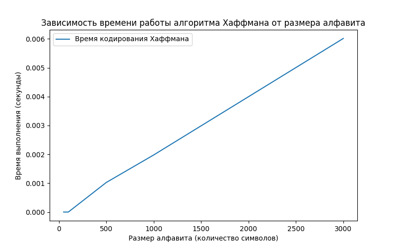

# Отчет по лабораторной работе 8
# Жадные алгоритмы

**Дата:** 2025-12-19   
**Семестр:** 3 курс 1 полугодие - 5 семестр  
**Группа:** ПИЖ-б-о-23-2(1)  
**Дисциплина:** Анализ сложности алгоритмов  
**Студент:** Хатуаева Дайана Тныбековна

## Цель работы
Изучить метод проектирования алгоритмов, известный как "жадный алгоритм". Освоить принцип принятия локально оптимальных решений на каждом шаге и понять условия, при которых этот подход приводит к глобально оптимальному решению. Получить практические навыки реализации жадных алгоритмов для решения классических задач, анализа их корректности и оценки эффективности.

## Теоретическая часть
- **Жадный алгоритм:** Алгоритм, который на каждом шаге принимает **локально оптимальное** решение в надежде, что итоговое решение будет глобально оптимальным.
- **Ключевые характеристики:**
  - **Жадный выбор:** На каждом шаге выбирается лучший из доступных вариантов в данный момент, без учета последствий для будущих шагов.
  - **Оптимальная подструктура:** Оптимальное решение задачи содержит в себе оптимальные решения её подзадач.
- **Области применения:** Жадные алгоритмы эффективны для задач, где выбор, сделанный на каждом шаге, не ухудшает возможности достижения глобального оптимума. Они часто работают быстро (полиномиальное время), но не всегда приводят к оптимальному решению.
- **Классические задачи:**
  - **Задача о выборе заявок (Interval Scheduling):** Выбор максимального количества непересекающихся интервалов.
  - **Задача о рюкзаке (Непрерывная/Дробная):** Выбор предметов с максимальной суммарной стоимостью, если можно брать части предметов.
  - **Алгоритм Хаффмана:** Оптимальное префиксное кодирование для сжатия данных.
  - **Построение минимального остовного дерева (Алгоритмы Прима и Краскала):** (Хотя это и графовый алгоритм, он является классическим примером жадного подхода).

## Практическая часть

### Выполненные задачи
- [x] Задача 1: Реализовать классические жадные алгоритмы.
- [x] Задача 2: Проанализировать их корректность (доказать или объяснить, почему жадный выбор приводит к
оптимальному решению).
- [x] Задача 3: Провести сравнительный анализ эффективности жадного подхода и других методов (например,
полного перебора для маленьких входных данных).
- [x] Задача 4: Решить практические задачи с применением жадного подхода.

### Ключевые фрагменты кода

#### Реализация жадных алгоритмов
В greedy_algorithms.py необходимо реализовать несколько алгоритмов.

**Задача о выборе заявок (Interval Scheduling)** — это классическая задача оптимизации, где нужно выбрать максимальное количество непересекающихся по времени заявок из заданного набора, чтобы они не конфликтовали, а ресурсы были использованы эффективно. Решается она так: отбирается заявка, которая заканчивается раньше всех, затем следующая из оставшихся, не пересекающаяся с первой, и так далее, заявки сортируются по времени завершения. 
```python
# greedy_algorithms
def interval_scheduling(intervals):
    """
    Задача о выборе заявок: ищем макс. множество непересекающихся интервалов.
    Жадный выбор — сортировка по времени окончания.

    Args:
        intervals: Список интервалов в формате (начало, конец)

    Returns:
        Список выбранных интервалов в том же формате

    Сложность: O(n log n)
    """
    # Анонимная функция возвращает 2-й элемент
    intervals = sorted(intervals, key=lambda x: x[1])

    result = []
    last_end = float('-inf')
    for start, end in intervals:
        if start >= last_end:
            result.append((start, end))
            last_end = end
    return result
```
---

**Непрерывный рюкзак (Fractional Knapsack).** Принцип работы: функция, которая максимизирует стоимость содержимого рюкзака, если можно брать дробные части предметов. Жадный выбор: сортировка по удельной стоимости (цена/вес) и взятие большего количества лучших предметов.
```python
# greedy_algorithms
def fractional_knapsack(weights, values, capacity):
    """
    Задача о рюкзаке: можно брать дробные части предметов.
    Жадный выбор — сортировка по удельной стоимости (value/weight).

    Args:
        weights: Веса предметов
        values: Стоимости предметов
        capacity: Вместимость рюкзака

    Returns:
        Максимальная стоимость, которую можно унести

    Сложность: O(n log n)
    """
    # Список троек: удельная стоимость, вес, стоимость
    items = sorted(
        ((v / w, w, v) for w, v in zip(weights, values)),
        reverse=True
    )

    total = 0
    for ratio, weight, value in items:
        if capacity == 0:
            break

        # Берем максимально возможное количество текущего предмета
        take = min(weight, capacity)
        total += ratio * take
        capacity -= take

    return total
```
---

**Алгоритм Хаффмана (Huffman Coding)**
— это алгоритм сжатия данных.
Суть алгоритма в построении специального двоичного дерева, где каждый символ получает уникальную комбинацию битов, зависящую от частоты появления в исходной последовательности.
```python
# greedy_algorithms
class HuffmanNode:
    """
    Класс узла дерева Хаффмана.

    Attributes:
        char: Символ (None для внутренних узлов)
        freq: Частота символа
        left: Левый потомок
        right: Правый потомок
    """
    def __init__(self, char, freq, left=None, right=None):
        self.char = char  # листовые узлы
        self.freq = freq
        self.left = left
        self.right = right

    def __lt__(self, other):
        # для heapq
        return self.freq < other.freq


def huffman_code(freqs):
    """
    Алгоритм Хаффмана: минимальное префиксное кодирование.
    Жадный выбор — объединяем узлы с наименьшими частотами.

    Args:
        freqs: Словарь символ->частота

    Returns:
        Кортеж (словарь кодов, корень дерева)

    Сложность: O(n log n)
    """
    heap = [HuffmanNode(char, freq) for char, freq in freqs.items()]
    heapq.heapify(heap)
    while len(heap) > 1:
        a = heapq.heappop(heap)
        b = heapq.heappop(heap)
        heapq.heappush(
            heap,
            HuffmanNode(None, a.freq + b.freq, a, b)
        )
    root = heap[0]
    codes = {}

    def gen_codes(node, prefix=""):
        if node.char is not None:
            codes[node.char] = prefix
        else:
            gen_codes(node.left, prefix + "0")
            gen_codes(node.right, prefix + "1")
    gen_codes(root)

    return codes, root


def print_huffman_tree(node, indent=""):
    """
    Визуализация дерева Хаффмана (рекурсивный вывод).

    node: Текущий узел для вывода
    indent: Отступ для текущего уровня
    """
    if node.char is not None:  # Если достигли листа
        print(indent + repr(node.char) + f":{node.freq}")
    else:
        print(indent + "*")
        print_huffman_tree(node.left, indent + "  ")
        print_huffman_tree(node.right, indent + "  ")
```

---
#### Сравнительный анализ (в analysis.py)
Для задачи о рюкзаке: сравнить результат жадного алгоритма для непрерывной версии с результатом точного алгоритма (полным перебором) для дискретной версии (0-1) на маленьких входных данных. Показать, что для дискретной задачи жадный подход может давать неоптимальный результат.

```python
# analysis.py
import itertools
from .greedy_algorithms import fractional_knapsack


def brute_force_01_knapsack(weights, values, capacity):
    """Полный перебор для задачи 0-1 рюкзака"""
    n = len(weights)
    best_value = 0
    best_combination = None

    # Перебираем все возможные комбинации предметов
    for r in range(n + 1):
        for combo in itertools.combinations(range(n), r):
            total_weight = sum(weights[i] for i in combo)
            total_value = sum(values[i] for i in combo)

            if total_weight <= capacity and total_value > best_value:
                best_value = total_value
                best_combination = combo
    return best_value, best_combination


def compare_knapsack():
    """Сравнение дробного и дискретного рюкзаков"""
    weights = [10, 20, 30]
    values = [60, 100, 120]
    capacity = 50

    # Дробный рюкзак (жадный)
    fractional_val = fractional_knapsack(weights, values, capacity)

    # Дискретный рюкзак (полный перебор)
    discrete_val, combo = brute_force_01_knapsack(weights, values, capacity)

    print("Сравнение рюкзаков:")
    print(f"Веса: {weights}, Стоимости: {values}, Вместимость: {capacity}")
    print(f"Дробный рюкзак (жадный): {fractional_val:.2f}")
    print(f"Дискретный рюкзак (0-1): {discrete_val}")
    print(f"Комбинация для 0-1: {combo}")

    # Пример, где жадный алгоритм для 0-1 не оптимален
    print("\nПример неоптимальности жадного для 0-1:")
    weights2 = [30, 20, 10]
    values2 = [120, 100, 60]

    # Жадное решение для 0-1 (берём по убыванию удельной стоимости)
    items = sorted(zip(values2, weights2),
                   key=lambda x: x[0]/x[1], reverse=True)

    cap = 50
    greedy_01_val = 0
    greedy_01_weight = 0

    for v, w in items:
        if greedy_01_weight + w <= cap:
            greedy_01_val += v
            greedy_01_weight += w

    # Оптимальное решение
    opt_val, opt_combo = brute_force_01_knapsack(weights2, values2, cap)

    print(f"Жадный для 0-1: {greedy_01_val}")
    print(f"Оптимальный для 0-1: {opt_val}")
    print(f"Разница: {opt_val - greedy_01_val}")
```

---
####  Задача
Решить задачу о минимальном количестве монет для выдачи сдачи.

```python
# task_solution
def min_coins(amount, coins):
    """
    Жадный алгоритм минимального числа монет для сдачи.

    Args:
        amount: Сумма для размена
        coins: Доступные номиналы монет

    Returns:
        Список монет для размена или None если размен невозможен

    Сложность: O(n) (число типов монет)
    """
    coins = sorted(coins, reverse=True)  # Сортировка по убывания номинала
    result = []

    for coin in coins:
        while amount >= coin:
            amount -= coin
            result.append(coin)

    # Если не смогли разменять полностью
    if amount > 0:
        return None
    return result
```

---
**Экспериментальное исследование и Визуализация**

- Замерить время работы алгоритма Хаффмана на данных разного размера.
- Построить график зависимости времени работы алгоритма от размера входных данных.

```python
# performance_analysis.py
import time
import random
import matplotlib.pyplot as plt
from .greedy_algorithms import huffman_code


def perf_huffman():
    """
    Эксперимент по замеру времени работы алгоритма Хаффмана.
    """
    # Размеры алфавита для тестирования
    sizes = [50, 100, 500, 1000, 3000]
    times = []

    for size in sizes:
        freqs = {str(i): random.randint(10, 1000) for i in range(size)}
        t0 = time.time()
        codes, _ = huffman_code(freqs)
        t1 = time.time()
        times.append(t1 - t0)
    fig, ax = plt.subplots(figsize=(8, 5))
    ax.plot(sizes, times, label='Время кодирования Хаффмана')
    ax.set_xlabel('Размер алфавита (количество символов)')
    ax.set_ylabel('Время выполнения (секунды)')
    ax.set_title('Зависимость времени работы алгоритма Хаффмана от размера алфавита')
    ax.legend()
    plt.savefig('huffman_time.png')
    plt.close()

    return sizes, times
```

## Результаты выполнения

### Пример работы программы
```
 Характеристики ПК для тестирования:
    - Процессор: 12th Gen Intel(R) Core(TM) i5-12450H
    - Оперативная память: 16 GB DDR4
    - ОС: Windows 10
    - Python: 3.12.10

==================================================
Демонстрация жадных алгоритмов
==================================================

1. Задача о выборе интервалов:
Интервалы: [(1, 4), (2, 6), (4, 7), (5, 9), (8, 10)]
Макс.непересекающиеся интервалы: [(1, 4), (4, 7), (8, 10)]

2. Задача о дробном рюкзаке:
Веса: [10, 6, 2], Стоимости: [40, 30, 6], Вместимость: 17
Макс. стоимость: 73.0

3. Кодирование Хаффмана:
Частоты символов: {'A': 10, 'B': 15, 'C': 30, 'D': 16, 'E': 29}
Коды: {'D': '00', 'A': '010', 'B': '011', 'E': '10', 'C': '11'}
Дерево Хаффмана:
*
  *
    'D':16
    *
      'A':10
      'B':15
  *
    'E':29
    'C':30

4. Задача о сдаче:
Монеты: [50, 10, 5, 1], Сумма: 66
Минимальные монеты: [50, 10, 5, 1]

==================================================

5. Сравнение рюкзаков:
Сравнение рюкзаков:
Веса: [10, 20, 30], Стоимости: [60, 100, 120], Вместимость: 50
Дробный рюкзак (жадный): 240.00
Дискретный рюкзак (0-1): 220
Комбинация для 0-1: (1, 2)

Пример неоптимальности жадного для 0-1:
Жадный для 0-1: 160
Оптимальный для 0-1: 220
Разница: 60

==================================================
Анализ производитлеьности
==================================================
Размеры алфавита: [50, 100, 500, 1000, 3000]
Время выполнения (сек): [0.0, 0.0, 0.0050296783447265625, 0.003040790557861328, 0.0044403076171875]
```



---
##  Анализ результатов:
Сравнить эффективность жадных алгоритмов с наивными реализациями.
Обсудить ограничения жадного подхода.
### Анализ эффективности жадных алгоритмов относительно наивых реализаций

1. Эффективность вычислений:
   - Жадные алгоритмы часто выполняются быстрее благодаря своей локальной оптимизации на каждом этапе. Например, в задаче о покрытии интервалов (Interval Scheduling) сортировка занимает O(nlogn), а сам процесс выбора интервалов выполняется за линейное время. В то же время, наивная реализация методом полного перебора требует экспоненциального времени O(2^n).

2. Качество решений:
   - В некоторых случаях жадные методы находят глобальные оптимальные решения, как в задачах Interval Scheduling и Huffman coding. Эти случаи доказывают свою оптимальность теоретически.
   - Однако в других ситуациях простые реализации (переборные) иногда обеспечивают лучшее качество результата ценой больших временных затрат.

3. Простота реализации:
   - Жадные алгоритмы проще реализовать, так как они действуют поэтапно, делая очевидный лучший выбор на каждой итерации. Напротив, наивные подходы требуют большего внимания к деталям и зачастую сложнее поддерживать.


### Ограничения жадного подхода

Хотя жадные алгоритмы эффективны и просты в реализации, у них есть ряд ограничений:

1. Подверженность локальным максимумам:
   - Часто жадные стратегии выбирают лучшие варианты на текущем шаге, игнорируя последствия будущих шагов. Это может привести к ситуации, когда итоговое решение далеко от оптимального.

2. Необходимость доказательств оптимальности:
   - Даже если кажется интуитивно понятным, что жадный подход эффективен, требуется строгий математический анализ для подтверждения его оптимальности. Во многих случаях доказать оптимальность сложно или невозможно.

3. Проблемы масштабируемости:
   - Хотя жадные алгоритмы работают быстро, некоторые задачи требуют значительных ресурсов памяти или вычислений даже при простом подходе. Поэтому существуют случаи, когда лучше применить альтернативные подходы вроде динамического программирования или целочисленного программирования.

---
### Заключение

Жадные алгоритмы представляют собой мощный инструмент для быстрого поиска решений в ряде практических задач за счёт своей простоты и скорости. Но важно также то, что они имеют ограничения, поэтому нужно ответственно подходить к вопросу их использования там, где требуются точные и гарантированные решения.


## Ответы на контрольные вопросы
1. В чём заключается основная идея жадных алгоритмов?

Основная идея жадных алгоритмов заключается в том, чтобы на каждом шаге выбирать наиболее оптимальное решение, надеясь, что этот выбор в конечном итоге приведёт к наиболее оптимальному результату.

2. Для задачи о выборе заявок (Interval Scheduling) жадный алгоритм, выбирающий интервалы с наименьшим временем окончания, является оптимальным. Объясните, почему эта жадная стратегия работает.

Задача Interval Scheduling заключается в максимизации количества выбранных неперекрывающихся интервалов из заданного множества. То есть выбирается интервал, который заканчивается раньше всех для того, чтобы оставить как можно больше свободного времени (ресурса) для остальных интервалов, ведь чем раньше освободится ресурс, тем больше шансов на выполнение остальных заявок.

3. Приведите пример задачи, для которой жадный алгоритм даёт оптимальное решение, и задачи, для которой он не даёт.

Жадный алгоритм даёт оптимальное решение в задаче о выборе заявок. Он не даёт оптимального решения, например, в задаче о выборе монеток.

4. В чём разница между непрерывной (дробной) и дискретной (0-1) задачами о рюкзаке? Для какой из них жадный алгоритм оптимален?

Дискретная (0-1) задача о рюкзаке заключается в том, что необходимо упаковать предметы таким образом, чтобы суммарная ценность была максимальной, но каждый предмет либо берётся целиком (полностью помещается в рюкзак), либо вообще не используется. Таким образом, предметы нельзя разделить, эта задача NP-трудная, и жадный алгоритм не гарантирует оптимальный результат.

Непрерывная (дробная) задача о рюкзаке, предполагает, что каждый предмет можно брать частями. Жадный алгоритм, сортирующий предметы по отношению ценности к весу и последовательно загружающий наиболее выгодные предметы, обеспечивает оптимальное решение.

5. Опишите жадный алгоритм построения кода Хаффмана. В чём его оптимальность?

Алгоритм Хаффмана применяется для сжатия данных путём построения префиксного кодирования символов строки текста. Основная идея состоит в создании бинарного дерева, в котором символы с меньшей частотой встречаемости располагаются ближе к корню, а часто используемые символы имеют короткие пути к листьям.

Как работает алгоритм Хаффмана:
1. Создаётся список узлов, где каждому символу соответствует узел с частотой появления.
2. Узлы сортируются по возрастающей частоте.
3. Бреётся два узла с минимальной частотой, далее они объединяются в новый родительский узел с суммой частот и снова добавляются обратно в список.
4. Шаги 2-3 повторяются,  пока не останется единственный корень дерева.
5. Каждое ребро обозначается цифрой ("0" слева, "1" справа), формируя уникальный двоичный путь для каждого символа.

Он глобально оптимален, потому что задача обладает оптимальной подструктурой и жадным свойством: локально оптимальные решения ведут к глобально оптимальному решению.

Таким образом, жадный алгоритм Хаффмана строит наилучший возможный способ сжатия данных с сохранением однозначности декодирования.