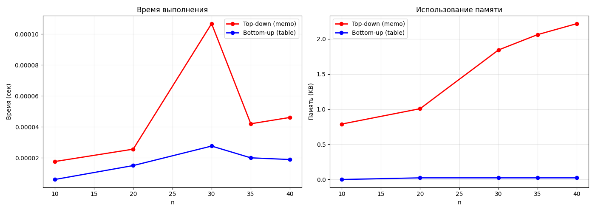
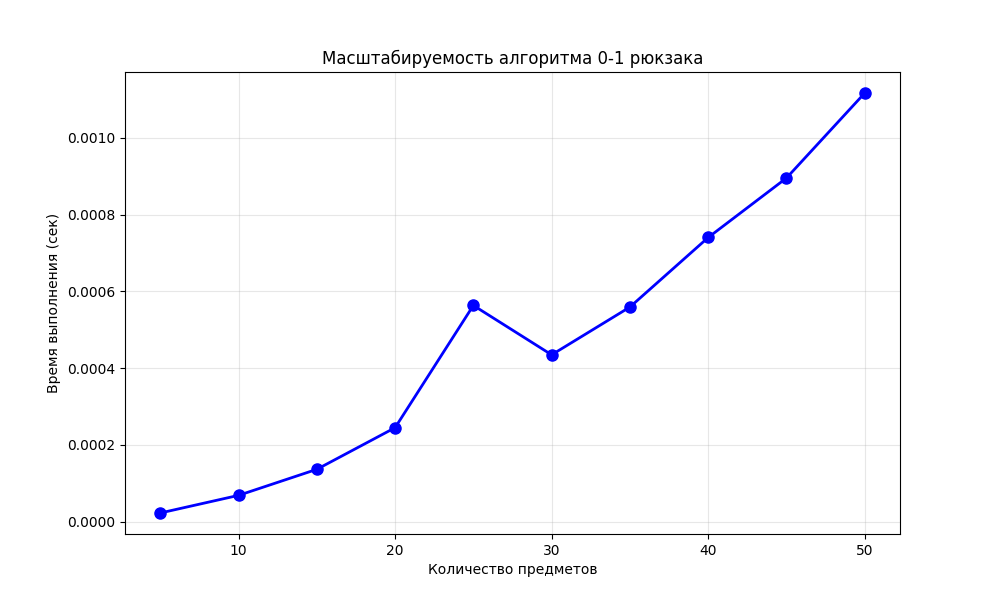

# Отчет по лабораторной работе 9
# Динамическое программирование

**Дата:** 2025-12-26  
**Семестр:** 3 курс 1 полугодие - 5 семестр  
**Группа:** ПИЖ-б-о-23-2(1)  
**Дисциплина:** Анализ сложности алгоритмов  
**Студент:** Хатуаева Дайана Тныбековна

## Цель работы
Изучить метод динамического программирования (ДП) как мощный инструмент для решения сложных задач путём их разбиения на перекрывающиеся подзадачи. Освоить два основных подхода к реализации ДП: нисходящий (с мемоизацией) и восходящий (с заполнением таблицы). Получить практические навыки выявления оптимальной подструктуры задач, построения таблиц ДП и анализа временной и пространственной сложности алгоритмов.

## Теоретическая часть
- Динамическое программирование (ДП): Метод решения задач, в которых оптимальное решение всей задачи зависит от оптимальных решений её перекрывающихся подзадач.
- Ключевые принципы:
  - Оптимальная подструктура: Оптимальное решение задачи может быть построено из оптимальных решений её подзадач.
  - Перекрывающиеся подзадачи: Подзадачи, решения которых используются многократно, а не один раз.
- Подходы к реализации:
  - Нисходящее ДП (Top-Down, с мемоизацией): Рекурсивное решение с сохранением (кэшированием) результатов решения подзадач для повторных вычислений.
  - Восходящее ДП (Bottom-Up, табличное): Итеративное решение, при котором подзадачи решаются от простейших к сложным, а их результаты заносятся в таблицу (массив).
- Области применения: Задачи оптимизации, подсчёта количества способов, нахождения наиболее вероятной последовательности.
- Классические задачи:
  - Числа Фибоначчи: Классический пример перекрывающихся подзадач.
  - Задача о рюкзаке (0-1 Knapsack): Выбор предметов с максимальной суммарной стоимостью без дробления.
  - Наибольшая общая подпоследовательность (LCS): Поиск самой длинной последовательности символов, которая является подпоследовательностью двух строк.
  - Расстояние Левенштейна (Редакционное расстояние): Минимальное количество операций вставки, удаления и замены символа, необходимых для превращения одной строки в другую.

## Практическая часть

### Выполненные задачи
- [x] Задача 1: Реализовать классические алгоритмы динамического программирования.
- [x] Задача 2: Реализовать оба подхода (нисходящий и восходящий) для решения задач.
- [x] Задача 3: Провести сравнительный анализ эффективности двух подходов.
- [x] Задача 4: Проанализировать временную и пространственную сложность алгоритмов.
- [x] Задача 5: Решить практические задачи с применением ДП.

### Ключевые фрагменты кода

#### Реализация алгоритмов ДП (в dynamic_programming.py)
Алгоритмы динамического программирования.
Содержит реализации Фибоначчи (3 варианта), рюкзака 0-1, LCS, расстояния Левенштейна.
"""

```python
def fib_naive(n):
    """Наивная рекурсия.
    Время: O(2^n),
    память: O(n).
    """
    if n <= 1:
        return n
    return fib_naive(n - 1) + fib_naive(n - 2)


def fib_memo(n):
    """Нисходящий подход с мемоизацией (top-down).
    Время: O(n),
    память: O(n).
    """
    memo = {}

    def fib_helper(k):
        # Проверяем, есть ли результат в кэше
        if k in memo:
            return memo[k]

        # Базовые случаи
        if k <= 1:
            result = k
        else:
            # Рекурсивный вызов с сохранением результатов
            result = fib_helper(k - 1) + fib_helper(k - 2)

        # Сохраняем результат в кэш
        memo[k] = result
        return result

    return fib_helper(n)


def fib_table(n):
    """Табличное решение (bottom-up).
    Время: O(n),
    память: O(n).
    """
    if n <= 1:
        return n
    dp = [0] * (n + 1)
    dp[1] = 1
    for i in range(2, n + 1):
        dp[i] = dp[i - 1] + dp[i - 2]
    return dp[n]


def knapsack_01(weights, values, capacity):
    """Рюкзак 0-1 с восстановлением решения.
    Время: O(n*W),
    память: O(n*W).
    """
    n = len(weights)
    dp = [[0] * (capacity + 1) for _ in range(n + 1)]

    for i in range(1, n + 1):
        wi = weights[i - 1]
        vi = values[i - 1]
        for w in range(capacity + 1):
            if wi <= w:
                without_item = dp[i - 1][w]
                with_item = dp[i - 1][w - wi] + vi
                dp[i][w] = max(without_item, with_item)
            else:
                dp[i][w] = dp[i - 1][w]

    # Восстановление решения
    items = []
    w = capacity
    for i in range(n, 0, -1):
        if dp[i][w] != dp[i - 1][w]:
            items.append(i - 1)
            w -= weights[i - 1]
    items.reverse()

    return dp[n][capacity], items, dp


def lcs(str1, str2):
    """LCS с восстановлением подпоследовательности.
    Время: O(m*n),
    память: O(m*n).
    """
    m, n = len(str1), len(str2)
    # Таблица размером (m+1)x(n+1)
    dp = [[0] * (n + 1) for _ in range(m + 1)]

    for i in range(1, m + 1):
        for j in range(1, n + 1):
            if str1[i - 1] == str2[j - 1]:  # Если символы совпадают
                dp[i][j] = dp[i - 1][j - 1] + 1
            else:
                dp[i][j] = max(dp[i - 1][j], dp[i][j - 1])

    # Восстановление самой последовательности
    seq = []
    i, j = m, n
    while i > 0 and j > 0:
        if str1[i - 1] == str2[j - 1]:
            seq.append(str1[i - 1])
            i -= 1  # Переход в предыдущую строку
            j -= 1  # Переход в предыдущий столбец
        elif dp[i - 1][j] >= dp[i][j - 1]:  # Если максимум сверху
            i -= 1
        else:
            j -= 1
    seq.reverse()

    return dp[m][n], "".join(seq), dp


def levenshtein_distance(s1, s2):
    """Расстояние Левенштейна.
    Время: O(m*n), память: O(m*n).
    """
    m, n = len(s1), len(s2)
    dp = [[0] * (n + 1) for _ in range(m + 1)]

    for i in range(m + 1):
        dp[i][0] = i
    for j in range(n + 1):
        dp[0][j] = j

    for i in range(1, m + 1):
        for j in range(1, n + 1):
            cost = 0 if s1[i - 1] == s2[j - 1] else 1
            dp[i][j] = min(
                dp[i - 1][j] + 1,  # Удаление
                dp[i][j - 1] + 1,  # Вставка
                dp[i - 1][j - 1] + cost,  # Замена
            )

    return dp[m][n], dp


if __name__ == "__main__":
    # Тестирование функций
    print("Fibonacci:")
    print(f"fib_naive(10) = {fib_naive(10)}")
    print(f"fib_memo(10) = {fib_memo(10)}")
    print(f"fib_table(10) = {fib_table(10)}")

    print("\nKnapsack 0-1:")
    weights = [1, 3, 4, 5]
    values = [1, 4, 5, 7]
    capacity = 7
    max_value, items, table = knapsack_01(weights, values, capacity)
    print(f"Max value: {max_value}")
    print(f"Items selected: {items}")

    print("\nLCS:")
    str1 = "ABCDGH"
    str2 = "AEDFHR"
    lcs_len, lcs_seq, _ = lcs(str1, str2)
    print(f"LCS length: {lcs_len}")
    print(f"LCS: {lcs_seq}")

    print("\nLevenshtein distance:")
    s1 = "kitten"
    s2 = "sitting"
    dist, _ = levenshtein_distance(s1, s2)
    print(f"Distance between '{s1}' and '{s2}': {dist}")
```

#### Решение задач
- Решить задачу "Размен монет" (минимальное количество монет для суммы) с помощью ДП.
- Решить задачу "Наибольшая возрастающая подпоследовательность (LIS)".

```python
def coin_change(coins, amount):
    """Минимальное количество монет для суммы."""
    dp = [float("inf")] * (amount + 1)
    dp[0] = 0

    for cur_sum in range(1, amount + 1):
        for coin in coins:
            if coin <= cur_sum:
                candidate = dp[cur_sum - coin] + 1
                if candidate < dp[cur_sum]:
                    dp[cur_sum] = candidate

    if dp[amount] == float("inf"):
        return -1
    return dp[amount]


def lis_quadratic(seq):
    """LIS (наибольшая возрастающая подпоследовательность).
    Время: O(n^2),
    память: O(n).
    """
    n = len(seq)
    if n == 0:
        return 0, []

    dp = [1] * n
    parent = [-1] * n

    for i in range(n):
        for j in range(i):
            if seq[j] < seq[i] and dp[j] + 1 > dp[i]:
                dp[i] = dp[j] + 1
                parent[i] = j

    max_len = max(dp)
    pos = dp.index(max_len)

    lis_seq = []
    while pos != -1:
        lis_seq.append(seq[pos])
        pos = parent[pos]
    lis_seq.reverse()

    return max_len, lis_seq
```

#### Анализ, исследование и визуализация (в comparison.py)


```python
import time
import tracemalloc
import matplotlib.pyplot as plt
import numpy as np
from dynamic_programming import fib_memo, fib_table, knapsack_01, lcs
from tasks import coin_change, lis_quadratic


"""Сравнительный анализ подходов динамического программирования."""


def compare_fib(n_values):
    """Сравнение memo (top-down) и table (bottom-up) для Фибоначчи."""
    times_memo = []
    times_table = []
    mem_memo = []
    mem_table = []

    for n in n_values:
        # Измерение для memo
        tracemalloc.start()
        start = time.perf_counter()
        fib_memo(n)
        time_m = time.perf_counter() - start
        mem_m, _ = tracemalloc.get_traced_memory()
        tracemalloc.stop()

        # Измерение для table
        tracemalloc.start()
        start = time.perf_counter()
        fib_table(n)
        time_t = time.perf_counter() - start
        mem_t, _ = tracemalloc.get_traced_memory()
        tracemalloc.stop()

        times_memo.append(time_m)
        times_table.append(time_t)
        mem_memo.append(mem_m / 1024)  # KB
        mem_table.append(mem_t / 1024)  # KB

        print(f"n={n}: memo={time_m:.6f}s, {mem_m/1024:.1f}KB | "
              f"table={time_t:.6f}s, {mem_t/1024:.1f}KB")

    return times_memo, times_table, mem_memo, mem_table


def greedy_fractional_knapsack(weights, values, capacity):
    """Жадный алгоритм дробного рюкзака для сравнения.
    Время: O(n log n),
    память: O(n).
    """
    items = []
    for i, (w, v) in enumerate(zip(weights, values)):
        items.append((v / w, w, v, i))
    items.sort(reverse=True)

    remaining = capacity
    total_value = 0.0

    for ratio, w, v, _ in items:
        if remaining <= 0:
            break
        if w <= remaining:
            total_value += v
            remaining -= w
        else:
            frac = remaining / w
            total_value += v * frac
            remaining = 0

    return total_value


def compare_knapsack_algorithms():
    """Сравнение 0-1 рюкзака (ДП) и дробного рюкзака (жадный)."""
    print("\n" + "="*60)
    print("Сравнение алгоритмов для рюкзака")
    print("="*60)

    weights = [1, 3, 4, 5]
    values = [1, 4, 5, 7]
    capacity = 7

    # 0-1 рюкзак (ДП)
    start = time.perf_counter()
    dp_value, dp_items, _ = knapsack_01(weights, values, capacity)
    dp_time = time.perf_counter() - start

    # Дробный рюкзак (жадный)
    start = time.perf_counter()
    greedy_value = greedy_fractional_knapsack(weights, values, capacity)
    greedy_time = time.perf_counter() - start

    print(f"0-1 Knapsack (DP):")
    print(f"  Макс стоимость: {dp_value}")
    print(f"  Выбранные предметы: {dp_items}")
    print(f"  Время выполнения: {dp_time:.6f}s")

    print(f"\nFractional Knapsack (Greedy):")
    print(f"  Макс стоимость: {greedy_value:.2f}")
    print(f"  Время выполнения: {greedy_time:.6f}s")

    print(f"\nРазница: {greedy_value - dp_value:.2f}")

    return dp_value, greedy_value


def scale_test_knapsack(max_items=20, capacity_multiplier=10):
    """Тестирование масштабируемости алгоритма рюкзака."""
    print("\n" + "="*60)
    print("Тестирование масштабируемости алгоритма рюкзака")
    print("="*60)

    item_counts = list(range(5, max_items + 1, 5))
    times = []

    for n in item_counts:
        # Генерация случайных данных
        np.random.seed(42)
        weights = np.random.randint(1, 20, n)
        values = np.random.randint(1, 50, n)
        capacity = np.sum(weights) // capacity_multiplier

        start = time.perf_counter()
        knapsack_01(weights.tolist(), values.tolist(), capacity)
        elapsed = time.perf_counter() - start

        times.append(elapsed)
        print(f"n={n}: время={elapsed:.4f}s")

    # Построение графика
    plt.figure(figsize=(10, 6))
    plt.plot(item_counts, times, 'bo-', linewidth=2, markersize=8)
    plt.xlabel('Количество предметов')
    plt.ylabel('Время выполнения (сек)')
    plt.title('Масштабируемость алгоритма 0-1 рюкзака')
    plt.grid(True, alpha=0.3)
    plt.savefig('knapsack_scaling.png', dpi=100)
    plt.show()

# Характеристики ПК
pc_info = """
Характеристики ПК для тестирования:
- Процессор: 12th Gen Intel(R) Core(TM) i5-12450H
- Оперативная память: 16 GB DDR4
- ОС: Windows 10
- Python: 3.12.10
"""
print(pc_info)


def test_all_algorithms():
    """Тестирование всех реализованных алгоритмов."""
    print("\n" + "="*60)
    print("Тестирование всех алгоритмов ДП")
    print("="*60)

    # 1. Размен монет
    print("\n1. Размен монет:")
    coins = [1, 2, 5, 10]
    amount = 27
    result = coin_change(coins, amount)
    if result == -1:
        print(f"Невозможно разменять сумму {amount}")
    else:
        print(f"Минимальное количество монет: {result}")
    print(f"Монеты: {coins}, сумма: {amount}")
    print(f"Минимальное количество монет: {result}")

    # 2. Наибольшая возрастающая подпоследовательность
    print("\n2. Наибольшая возрастающая подпоследовательность:")
    seq = [10, 22, 9, 33, 21, 50, 41, 60, 80]
    lis_len, lis_seq = lis_quadratic(seq)
    print(f"Последовательность: {seq}")
    print(f"Длина LIS: {lis_len}")
    print(f"LIS: {lis_seq}")

    # 3. Визуализация таблицы LCS
    print("\n3. Визуализация таблицы LCS:")
    str1 = "ABCD"
    str2 = "ACBAD"
    lcs_len, lcs_seq, dp_table = lcs(str1, str2)
    print(f"Строка 1: {str1}")
    print(f"Строка 2: {str2}")
    print(f"LCS: {lcs_seq} (длина: {lcs_len})")


if __name__ == "__main__":
    # Часть 1: Сравнение подходов для Фибоначчи
    print("Часть 1: Сравнение top-down и bottom-up для чисел Фибоначчи")
    print("-" * 60)

    n_values = [10, 20, 30, 35, 40]
    times_memo, times_table, mem_memo, mem_table = compare_fib(n_values)  # Передаем список

    # Визуализация результатов
    fig, (ax1, ax2) = plt.subplots(1, 2, figsize=(14, 5))

    # График времени
    ax1.plot(n_values, times_memo, 'ro-', label='Top-down (memo)', linewidth=2)
    ax1.plot(n_values, times_table, 'bo-', label='Bottom-up (table)', linewidth=2)
    ax1.set_xlabel('n')
    ax1.set_ylabel('Время (сек)')
    ax1.set_title('Время выполнения')
    ax1.legend()
    ax1.grid(True, alpha=0.3)

    # График памяти
    ax2.plot(n_values, mem_memo, 'ro-', label='Top-down (memo)', linewidth=2)
    ax2.plot(n_values, mem_table, 'bo-', label='Bottom-up (table)', linewidth=2)
    ax2.set_xlabel('n')
    ax2.set_ylabel('Память (KB)')
    ax2.set_title('Использование памяти')
    ax2.legend()
    ax2.grid(True, alpha=0.3)

    plt.tight_layout()
    plt.savefig('fib_comparison.png', dpi=100)
    plt.show()

    # Часть 2: Сравнение алгоритмов рюкзака
    compare_knapsack_algorithms()

    # Часть 3: Тестирование всех алгоритмов
    test_all_algorithms()

    # Часть 4: Тестирование масштабируемости
    scale_test_knapsack(max_items=50, capacity_multiplier=3)

    # Дополнительный анализ сложности
    print("\n" + "="*60)
    print("Анализ временной и пространственной сложности")
    print("="*60)
    print("""
    Числа Фибоначчи:
      - Наивная рекурсия: O(2^n) время, O(n) память (стек)
      - Top-down с мемоизацией: O(n) время, O(n) память
      - Bottom-up табличный: O(n) время, O(n) память
      - Оптимизированный bottom-up: O(n) время, O(1) память

    Рюкзак 0-1:
      - Bottom-up: O(n*W) время, O(n*W) память

    LCS (наибольшая общая подпоследовательность):
      - Bottom-up: O(m*n) время, O(m*n) память

    Расстояние Левенштейна:
      - Bottom-up: O(m*n) время, O(m*n) память

    Размен монет:
      - Bottom-up: O(amount * len(coins)) время, O(amount) память

    LIS (наибольшая возрастающая подпоследовательность):
      - Квадратичный алгоритм: O(n^2) время, O(n) память
    """)
```


## Результаты выполнения

#### Тестирование функций:
```
Fibonacci:
fib_naive(10) = 55    
fib_memo(10) = 55     
fib_table(10) = 55    

Knapsack 0-1:
Max value: 9
Items selected: [1, 2]

LCS:
LCS length: 3
LCS: ADH

Levenshtein distance:
Distance between 'kitten' and 'sitting': 3
```

#### comparison.py:
```
Характеристики ПК для тестирования:
- Процессор: 12th Gen Intel(R) Core(TM) i5-12450H
- Оперативная память: 16 GB DDR4
- ОС: Windows 10
- Python: 3.12.10

Часть 1: Сравнение top-down и bottom-up для чисел Фибоначчи 
------------------------------------------------------------
n=10: memo=0.000022s, 0.8KB | table=0.000006s, 0.0KB
n=20: memo=0.000024s, 1.0KB | table=0.000018s, 0.0KB
n=30: memo=0.000033s, 1.8KB | table=0.000028s, 0.0KB
n=35: memo=0.000038s, 2.1KB | table=0.000031s, 0.0KB
n=40: memo=0.000044s, 2.2KB | table=0.000029s, 0.0KB

============================================================
Сравнение алгоритмов для рюкзака
============================================================
0-1 Knapsack (DP):
  Макс стоимость: 9
  Выбранные предметы: [1, 2]
  Время выполнения: 0.000034s

Fractional Knapsack (Greedy):
  Макс стоимость: 9.67
  Время выполнения: 0.000014s

Разница: 0.67

============================================================
Тестирование всех алгоритмов ДП
============================================================

1. Размен монет:
Минимальное количество монет: 4
Монеты: [1, 2, 5, 10], сумма: 27
Минимальное количество монет: 4

2. Наибольшая возрастающая подпоследовательность:
Последовательность: [10, 22, 9, 33, 21, 50, 41, 60, 80]
Длина LIS: 6
LIS: [10, 22, 33, 50, 60, 80]

3. Визуализация таблицы LCS:
Строка 1: ABCD
Строка 2: ACBAD
LCS: ABD (длина: 3)

============================================================
Тестирование масштабируемости алгоритма рюкзака
============================================================
n=5: время=0.0000s
n=10: время=0.0001s
n=15: время=0.0002s
n=20: время=0.0003s
n=25: время=0.0006s
n=30: время=0.0005s
n=35: время=0.0007s
n=40: время=0.0009s
n=45: время=0.0009s
n=50: время=0.0014s

============================================================
Анализ временной и пространственной сложности
============================================================

    Числа Фибоначчи:
      - Наивная рекурсия: O(2^n) время, O(n) память (стек)
      - Top-down с мемоизацией: O(n) время, O(n) память
      - Bottom-up табличный: O(n) время, O(n) память
      - Оптимизированный bottom-up: O(n) время, O(1) память

    Рюкзак 0-1:
      - Bottom-up: O(n*W) время, O(n*W) память

    LCS (наибольшая общая подпоследовательность):
      - Bottom-up: O(m*n) время, O(m*n) память

    Расстояние Левенштейна:
      - Bottom-up: O(m*n) время, O(m*n) память

    Размен монет:
      - Bottom-up: O(amount * len(coins)) время, O(amount) память

    LIS (наибольшая возрастающая подпоследовательность):
      - Квадратичный алгоритм: O(n^2) время, O(n) память
```

### Графики





## Ответы на контрольные вопросы
1. Какие два основных свойства задачи указывают на то, что для ее решения можно применить динамическое программирование?
- Оптимальная подструктура (Optimal Substructure)

Оптимальное решение задачи может быть построено из оптимальных решений её подзадач.

- Перекрывающиеся подзадачи (Overlapping Subproblems)

При рекурсивном разбиении задачи возникают одни и те же подзадачи, которые решаются многократно. Это свойство позволяет экономить вычисления путём мемоизации (запоминания результатов)

2. В чем разница между нисходящим (top-down) и восходящим (bottom-up) подходами в динамическом программировании?


| Характеристика | Нисходящий (Top-Down) | Восходящий (Bottom-Up) |
|----------------|-----------------------|------------------------|
| Подход         | Рекурсия с мемоизацией | Итеративное заполнение таблицы |
| Направление    | От общей задачи к базовым случаям | От базовых случаев к общей задаче |
| Реализация     | Рекурсивные вызовы + кэширование | Вложенные циклы + таблица DP |
| Память         | Использует стек вызовов + хранилище для результатов | Использует только таблицу DP |
| Вычислительные затраты | Вычисляет только необходимые подзадачи | Вычисляет все возможные подзадачи |
| Читаемость     | Более естественная (ближе к математической формулировке) | Более явная, но может быть сложнее для понимания |


3. Как задача о рюкзаке 0-1 демонстрирует свойство оптимальной подструктуры?

Формулировка задачи: есть n предметов с весами w[i] и стоимостями v[i], вместимость рюкзака W. Нужно максимизировать суммарную стоимость предметов, не превышая вместимость.

Оптимальная подструктура проявляется в рекуррентном соотношении: dp[i][w] - максимальная стоимость, которую можно получить, используя первые i предметов и вместимость w.

Базовый случай: dp[0][w] = 0 (нет предметов), dp[i][0] = 0 (нет вместимости)

Если оптимальное решение для dp[i][w] включает i-й предмет, то оставшаяся часть (dp[i-1][w - w[i]]) должна быть оптимальным решением для подзадачи с i-1 предметами и вместимостью w - w[i].

4. Опишите, как строится и заполняется таблица для решения задачи о наибольшей общей подпоследовательности (LCS).

Алгоритм построения таблицы
1. Инициализация таблицы:

- Создаём таблицу dp размером (m+1) × (n+1), где m = len(X), n = len(Y).
- dp[i][j] будет хранить длину LCS для префиксов X[0:i] и Y[0:j]
- Первая строка и первый столбец заполняются нулями:
```
dp[0][j] = 0 для всех j (пустая строка X)
dp[i][0] = 0 для всех i (пустая строка Y)
```

2. Правила заполнения:
Для каждого i от 1 до m и j от 1 до n:
```
если X[i-1] == Y[j-1]:
    dp[i][j] = dp[i-1][j-1] + 1
иначе:
    dp[i][j] = max(dp[i-1][j], dp[i][j-1])
```
3. Интерпретация правил:

- Если последние символы совпадают (X[i-1] == Y[j-1]), они включаются в LCS

- Если не совпадают, LCS будет максимальным из двух вариантов:
  - Без последнего символа X: dp[i-1][j].
  - Без последнего символа Y: dp[i][j-1].


5. Как с помощью динамического программирования можно уменьшить сложность вычисления чисел Фибоначчи с экспоненциальной до линейной или даже до O(log n)

Исходная рекурсивная формула вычисления чисел Фибоначчи обладает экспоненциальной сложностью O(2^n), так как многократно решает одни и те же подзадачи.

- Методы динамического программирования позволяют сократить эту сложность:

1. Табличный подход (Bottom-Up)
Запоминаются предыдущие результаты и используется простая итеративная схема.
Хранится лишь небольшая таблица или пару переменных.
Временная сложность становится линейной: O(n).

2. Мемоизация (Top-Down)
Рекурсивные вызовы дополняются кэшированием уже вычисленных значений.
Тем самым исключается многократное выполнение одинаковых вычислений.
Аналогично Bottom-Up, временная сложность снижается до O(n).

Дополнительный метод:

3. Матричное возведение в степень:
Применяются свойства матриц и быстрое возведение в степень.
Такой подход даёт лучшую асимптотику — O(logn).

Итак, с помощью динамического программирования сложность уменьшается с экспоненциальной до линейной O(n) или даже до логарифмической O(logn).